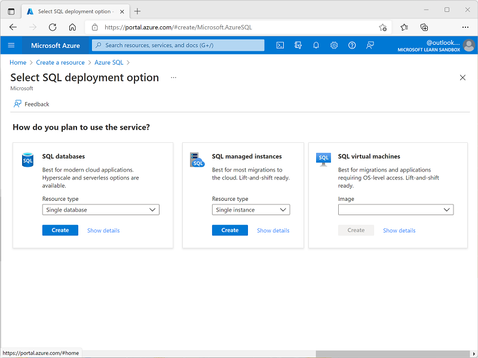

---
lab:
  title: استكشاف Azure SQL Database
  module: Explore relational data in Azure
---

# استكشاف Azure SQL Database

في هذا التمرين، ستقوم بتوفير مورد قاعدة بيانات Azure SQL في اشتراكك في Azure، ثم استخدام SQL للاستعلام عن الجداول في قاعدة بيانات علائقية.

سيستغرق إكمال هذا التمرين المعملي **15** دقيقة.

## قبل أن تبدأ

ستحتاج إلى [اشتراك Azure](https://azure.microsoft.com/free) حيث تمتلك وصول على المستوى الإداري.

## توفير مورد Azure SQL Database

1. في [مدخل](https://portal.azure.com?azure-portal=true) Microsoft Azure، حدد **&65291; أنشئ موردا** من الزاوية العلوية اليسرى وابحث عن `Azure SQL`. ثم في صفحة **Azure SQL** الناتجة، حدد «**Create**».

1. راجع خيارات Azure SQL المتوفرة، ثم في إطار «**SQL databases**»، تأكد من تحديد «**Single database**»، وحدد «**Create**».

    

1. أدخل القيم التالية في صفحة "**Create SQL Database**"، واترك جميع الخصائص الأخرى على الإعداد الافتراضي:
    - **الاشتراك**: حدد اشتراك Azure الخاص بك.
    - **مجموعة الموارد**: قم بإنشاء مجموعة موارد جديدة باسم من اختيارك.
    - **اسم** قاعدة البيانات: `AdventureWorks`
    - **Server**: حدد «**Create new**» وأنشئ خادماً جديداً باسم فريد في أي موقع متوفر. استخدم **مصادقة SQL** وحدد اسمك على أنه تسجيل دخول مسؤول الخادم وحدد كلمة مرور معقدة بشكل مناسب (تذكر كلمة المرور - ستحتاج إليها لاحقًا!)
    - **هل تريد استخدام تجمع مرن من SQL؟**: *No*
    - **بيئة حمل العمل**: التطوير
    - **Compute + storage**: اتركه دون تغيير
    - **تكرار تخزين النسخ الاحتياطي**: *Locally-redundant backup storage*

1. في صفحة "**Create SQL Database**"، حدد "**Next :Networking >**"، وفي صفحة "**Networking**" في القسم "**Network connectivity**"، حدد "**Public endpoint**". ثم حدد «**Yes**» لكلا الخيارين في قسم **Firewall rules** للسماح بالوصول إلى خادم قاعدة البيانات من خدمات Azure وعنوان IP للعميل الحالي.

1. حدد "**Next: Security >**" وعيّن الخيار "**Enable Microsoft Defender for SQL**" إلى "**Not now**".

1. حدد "**Next: Additional Settings >**"، وفي علامة التبويب "**Additional settings**" عيّن الخيار "**Use existing data**" إلى "**Sample**" (سيؤدي ذلك إلى إنشاء عينة قاعدة بيانات يمكنك استكشافها لاحقًا).

1. حدد "**Review + Create**"، ثم حدد "**Create**" لإنشاء قاعدة بيانات Azure SQL.

1. يُرجى الانتظار لاكتمال التوزيع. ثم انتقل إلى المورد الذي تم توزيعه، والذي يجب أن يبدو كما يلي:

    

1. في الجزء على الجانب الأيسر من الصفحة، حدد «**Query editor (preview)**» ثم سجل الدخول باستخدام تسجيل دخول المسؤول وكلمة المرور اللذان حددتهما للخادم.
    
    >**ملاحظة**: إذا تم عرض رسالة خطأ تفيد بأن عنوان IP للعميل غير مسموح به، فحدد **الارتباط Allowlist IP ...** في نهاية الرسالة للسماح بالوصول ومحاولة تسجيل الدخول مرة أخرى (قمت مسبقا بإضافة عنوان IP للعميل الخاص بالكمبيوتر إلى قواعد جدار الحماية، ولكن قد يتصل محرر الاستعلام من عنوان مختلف اعتمادا على تكوين الشبكة.)
    
    يبدو محرر الاستعلام كما يلي:
    
    

1. وسّع مجلد **Tables** لمشاهدة الجداول في قاعدة البيانات.

1. في جزء **Query 1**، أدخل عبارة SQL التالية:

    ```sql
   SELECT * FROM SalesLT.Product;
    ```

1. حدد "**&#9655; Run**" فوق الاستعلام لتشغيله وعرض النتائج، والتي يجب أن تشمل جميع الأعمدة لجميع الصفوف في الجدول "**SalesLT.Product**" كما هو موضح هنا:

    

1. استبدل عبارة SELECT بالتعليمات البرمجية التالية، ثم حدد "**&#9655; Run**" لتشغيل الاستعلام الجديد ومراجعة النتائج (التي لا تتضمن إلا أعمدة "**ProductID**"، و"**Name**"، و"**ListPrice**"، و"**ProductCategoryID**"):

    ```sql
   SELECT ProductID, Name, ListPrice, ProductCategoryID
   FROM SalesLT.Product;
    ```

1. الآن حاول الاستعلام التالي الذي يستخدم JOIN للحصول على اسم الفئة من جدول **SalesLT.ProductCategory**:

    ```sql
   SELECT p.ProductID, p.Name AS ProductName,
           c.Name AS Category, p.ListPrice
   FROM SalesLT.Product AS p
   JOIN [SalesLT].[ProductCategory] AS c
       ON p.ProductCategoryID = c.ProductCategoryID;
    ```

1. أغلق جزء محرر الاستعلام، وتجاهل عمليات التحرير.

> **تلميح**: يمكنك حذف مجموعة الموارد التي أنشأتها في هذا التمرين إذا انتهيت من استكشاف Azure SQL Database.
