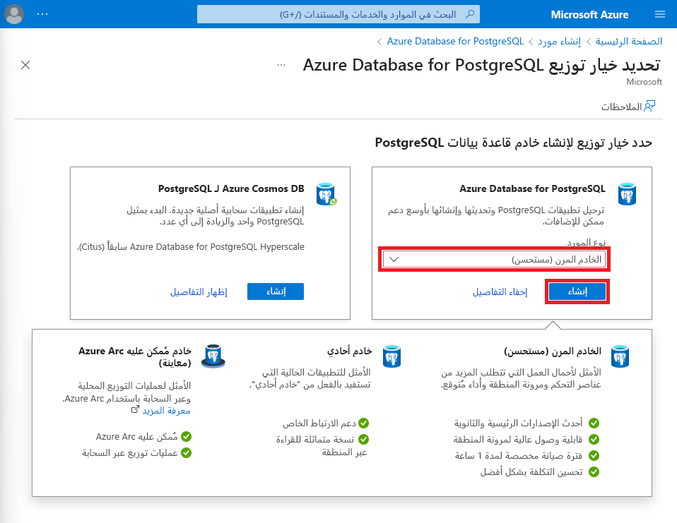
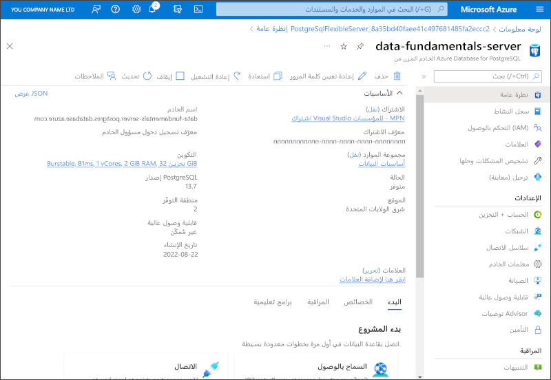

---
lab:
  title: استكشاف Azure Database for PostgreSQL
  module: Explore relational data in Azure
---

# استكشاف Azure Database for PostgreSQL

ستُوفّر في هذا التمرين مورد Azure Database for PostgreSQL في اشتراك Azure.

سيستغرق إكمال هذا التمرين المعملي **5** دقائق.

## قبل أن تبدأ

ستحتاج إلى [اشتراك Azure](https://azure.microsoft.com/free) حيث تمتلك وصول على المستوى الإداري.

## توفير مورد Azure Database for PostgreSQL

ستقوم في هذا التمرين بتوفير مورد Azure Database for PostgreSQL.

1. في مدخل Microsoft Azure، حدد **&65291; أنشئ موردا** من الزاوية العلوية اليسرى وابحث عن `Azure Database for PostgreSQL`. ثم في صفحة **Azure Database for PostgreSQL**، حدد «**Create**».

1. راجع قاعدة بيانات Azure لخيارات PostgreSQL المتوفرة، ثم في لوحة **Azure Database for PostgreSQL**، حدد **Flexible server (Recommended)**، ثم **Create**.

    

1. أدخل القيم التالية في صفحة **Create SQL Database**:
    - **الاشتراك**: حدد اشتراك Azure الخاص بك.
    - **مجموعة الموارد**: قم بإنشاء مجموعة موارد جديدة باسم من اختيارك.
    - **New Server**: أدخل اسمًا مميزًا.
    - **Region**: حدد منطقة قريبة منك.
    - **PostgreSQL version**: اتركه دون تغيير.
    - **Workload type**: حدد "**Development**".
    - **Compute + storage**: اتركه دون تغيير.
    - **Availability zone**: اتركه دون تغيير.
    - **Enable high availability**: اتركه دون تغيير.
    - **Admin username**: اكتب اسمك.
    - **Password** و**Confirm password**: كلمة مرور معقدة مناسبة.

1. حدد **Next: Networking**.

1. ضمن "**Firewall rules**"، حدد "**&#65291; Add current client IP address**".

1. حدد "**Review + Create**"، ثم حدد "**Create**" لإنشاء قاعدة بيانات Azure PostgreSQL.

1. يُرجى الانتظار لاكتمال التوزيع. ثم انتقل إلى المورد الذي تم توزيعه، والذي يجب أن يبدو كما يلي:

    

1. راجع خيارات إدارة مورد Azure Database for PostgreSQL.

> **تلميح**: يمكنك حذف مجموعة الموارد التي أنشأتها في هذا التمرين إذا انتهيت من استكشاف Azure Database for PostgreSQL.
