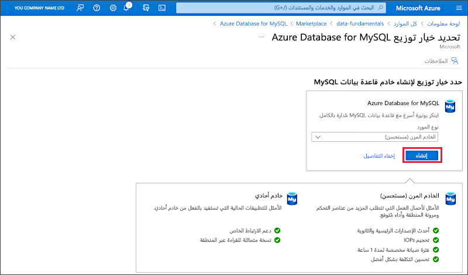
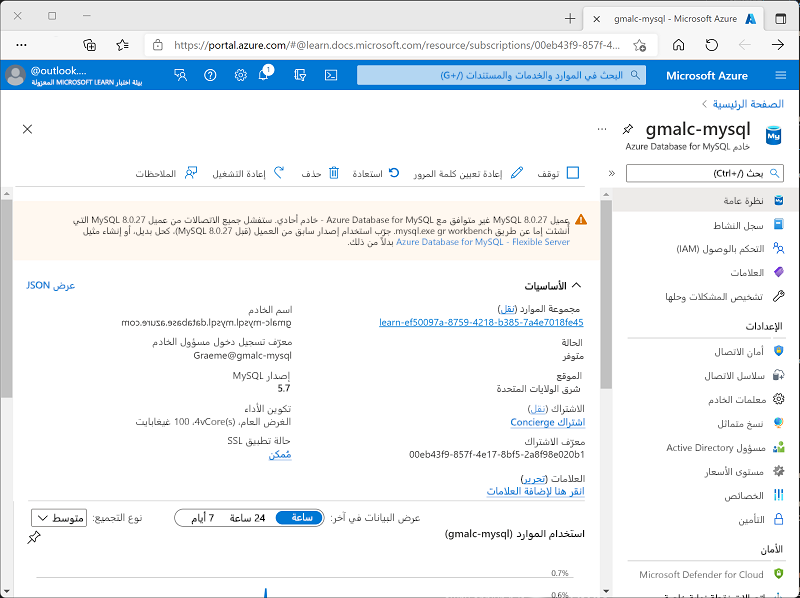

---
lab:
  title: استكشاف Azure Database for MySQL
  module: Explore relational data in Azure
---

# استكشاف Azure Database for MySQL

ستُوفّر في هذا التمرين مورد Azure Database for MySQL في اشتراك Azure.

سيستغرق إكمال هذا التمرين المعملي **5** دقائق.

## قبل البدء

ستحتاج إلى [اشتراك Azure](https://azure.microsoft.com/free) حيث تمتلك وصول على المستوى الإداري.

## توفير مورد Azure Database for MySQL

ستقوم في هذا التمرين بتوفير مورد Azure Database for MySQL.

1. In the Azure portal, select <bpt id="p1">**</bpt>&amp;#65291; Create a resource<ept id="p1">**</ept> from the upper left-hand corner and search for <bpt id="p2">*</bpt>Azure Database for MySQL<ept id="p2">*</ept>. Then in the resulting <bpt id="p1">**</bpt>Azure Database for MySQL<ept id="p1">**</ept> page, select <bpt id="p2">**</bpt>Create<ept id="p2">**</ept>.

1. Review the Azure Database for MySQL options that are available. Then for <bpt id="p1">**</bpt>Resource type<ept id="p1">**</ept>, select <bpt id="p2">**</bpt>Flexible Server<ept id="p2">**</ept> and select <bpt id="p3">**</bpt>Create<ept id="p3">**</ept>.

    

1. أدخل القيم التالية في صفحة **Create SQL Database**:
    - **الاشتراك**: حدد اشتراك Azure الخاص بك.
    - **Resource group**: أنشئ مجموعة موارد جديدة وامنحها اسماً تختاره.
    - **New Server**: أدخل اسمًا مميزًا.
    - **Region**: أي موقع متوفر بالقرب منك.
    - **MySQL Version**: اتركه دون تغيير.
    - **Workload type**: لمشاريع التطوير أو الهواية.
    - **Compute + storage**: اتركه دون تغيير.
    - **Availability zone**: اتركه دون تغيير.
    - **Enable high availability**: اتركه دون تغيير.
    - **Admin username**: اسمك
    - **Password** و**Confirm password**: كلمة مرور معقدة مناسبة

1. حدد **Next: Networking**.

1. ضمن "**Firewall rules**"، حدد " **&#65291; Add current client IP address**".

1. حدد "**Review + Create**"، ثم حدد "**Create**" لإنشاء قاعدة بيانات Azure MySQL.

1. Wait for deployment to complete. Then go to the resource that was deployed, which should look like this:

    

1. راجع خيارات إدارة مورد Azure Database for MySQL.

> **تلميح**: يمكنك حذف مجموعة الموارد التي أنشأتها في هذا التمرين إذا انتهيت من استكشاف Azure Database for MySQ.
