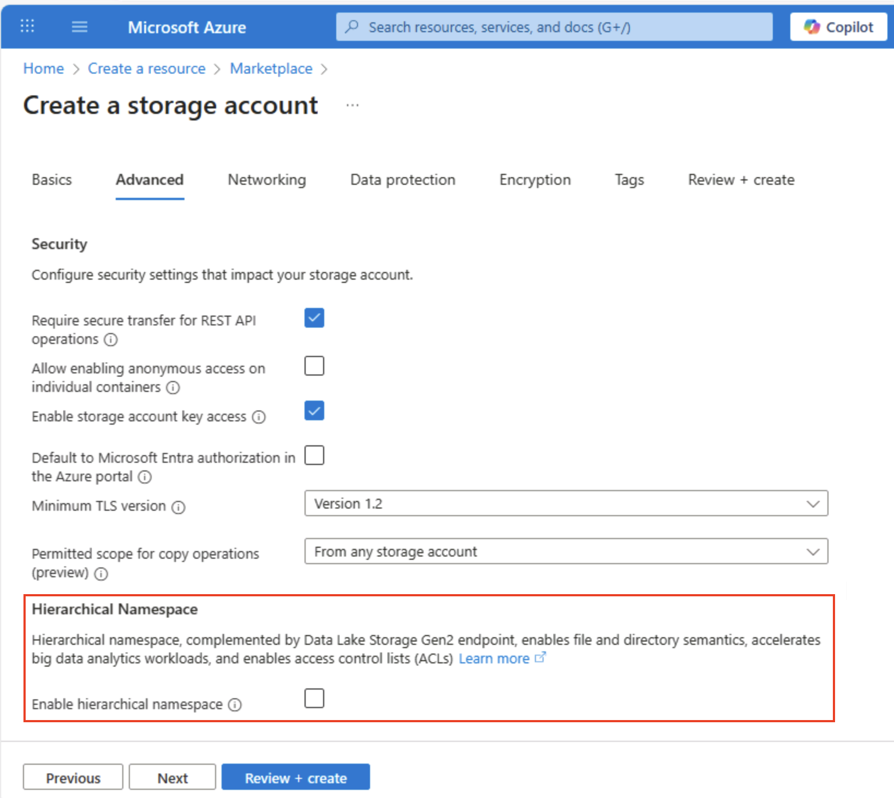

---
lab:
  title: استكشاف Azure Storage
  module: Explore Azure Storage for non-relational data
---

# استكشاف Azure Storage

في هذا التمرين، ستتعلم كيفية توفير حساب Azure Storage وتكوينه، واستكشاف خدماته الأساسية: Blob storage وData Lake Storage Gen2 وAzure Files وAzure Tables. ستكتسب خبرة عملية في إنشاء الحاويات، وتحميل البيانات، وتمكين مساحات الأسماء الهرمية، وإعداد مشاركات الملفات، وإدارة كيانات الجدول. ستساعدك هذه المهارات على فهم كيفية تخزين البيانات غير العلائقية وتنظيمها وتأمينها في Azure لمختلف التحليلات وسيناريوهات التطبيق.

سيستغرق إكمال هذا التمرين المعملي **15** دقيقة.

> _**تلميح**: يساعدك فهم الغرض من كل إجراء في تصميم حلول تخزين في وقت لاحق توازن بين أهداف التكلفة والأداء والأمان والتحليلات. هذه الملاحظات الموجزة لماذا تربط كل خطوة لسبب في العالم الحقيقي._

## قبل أن تبدأ

ستحتاج إلى [اشتراك Azure](https://azure.microsoft.com/free) حيث تمتلك وصول على المستوى الإداري.

## توفير حساب Azure Storage

تتمثل الخطوة الأولى في استخدام Azure Storage في توفير حساب Azure Storage في اشتراكك في Azure.

> _**تلميح**: حساب التخزين هو الحد الآمن القابل للفوترة لجميع خدمات تخزين Azure (الكائنات الثنائية كبيرة الحجم والملفات وقوائم الانتظار والجداول). يتم تطبيق النهج والتكرار والتشفير والشبكات والتحكم في الوصول من هنا لأسفل._

1. إذا لم تكن فعلت ذلك، فسجّل الدخول إلى [مدخل Microsoft Azure](https://portal.azure.com?azure-portal=true).

1. في الصفحة الرئيسية لمدخل Azure، حدد **&65291; أنشئ موردا** من الزاوية العلوية اليسرى وابحث عن `Storage account`. ثم في صفحة **حساب التخزين** الناتجة، حدد **"Create"**.

    

1. أدخل القيم التالية في الصفحة **إنشاء حساب تخزين**:
   
    - **الاشتراك**: حدد اشتراك Azure الخاص بك.
    - **مجموعة الموارد**: قم بإنشاء مجموعة موارد جديدة باسم من اختيارك.
    - **اسم حساب التخزين**: أدخل اسماً فريداً لحساب التخزين باستخدام الأحرف الصغيرة والأرقام.
    - **Region**: حدد أي موقع متاح.
    - **الأداء**: *قياسي*
    - **التكرار**: *التخزين المتكرر محلياً (LRS)*

    

    > _**تلميح**: مجموعة موارد جديدة تسهل عملية التنظيف. Standard + LRS هو الأساس الأقل تكلفة، وهو جيد للتعلم. يحتفظ LRS بثلاث نسخ متزامنة في منطقة واحدة، كافية للبيانات التجريبية غير الحرجة دون دفع ثمن النسخ المتماثل الجغرافي._

1. حدد "**Next: Advanced >**" واعرض خيارات التكوين المتقدمة. على وجه الخصوص، لاحظ أن هذا هو المكان الذي يمكنك فيه تمكين مساحة أسماء هرمية لدعم Azure Data Lake Storage Gen2. اترك هذا الخيار **<u>unselected</u>** (ستُمكنه لاحقاً)، ثم حدد "**Next: Networking >**" لعرض خيارات الشبكة لحساب التخزين.
   
   

1. حدد "**Next: Data protection >**" ثم في القسم "**Recovery**" <u>ألغ</u> تحديد جميع خيارات "**Enable soft delete...**". تحتفظ هذه الخيارات بالملفات المحذوفة للاسترداد اللاحق، ولكن يمكن أن تسبب مشكلات لاحقاً عند تمكين مساحة أسماء هرمية.

    

1. استمر عبر صفحات **التالي >** المتبقية دون تغيير أي من الإعدادات الافتراضية، ثم في صفحة **المراجعة**، انتظر حتى يتم التحقق من صحة ما حددت، وحدد **إنشاء**" لإنشاء حساب Azure Storage.

1. يُرجى الانتظار لاكتمال التوزيع. ثم انتقل إلى المورد الذي تم توزيعه.

## استكشاف تخزين كائن ثنائي كبير الحجم

الآن بعد أن أصبح لديك حساب Azure Storage، يمكنك إنشاء حاوية لبيانات الكائن الثنائي كبير الحجم.

> _**تلميح**: تجمع الحاوية الكائنات الثنائية كبيرة الحجم وهي أول مستوى تحديد النطاق للتحكم في الوصول. بدءا من تخزين كائن ثنائي كبير الحجم عادي (لا توجد مساحة اسم هرمية) يظهر سلوك المجلد الظاهري الذي ستقارنه ب Data Lake Gen2 لاحقا._

1. قم بتنزيل ملف JSON [product1.json](https://aka.ms/product1.json?azure-portal=true) من `https://aka.ms/product1.json` واحفظه على جهاز الكمبيوتر (يمكنك حفظه في أي مجلد - ستقوم بتحميله إلى تخزين كائن ثنائي كبير الحجم لاحقاً).

    *إذا تم عرض ملف JSON في المتصفح، فاحفظ الصفحة كـ **product1.json**.*

1. في صفحة مدخل Microsoft Azure لحاوية التخزين، على الجانب الأيسر، في القسم **Data storage**، حدد **Containers**.
   
    

1. في **صفحة Containers** ، حدد **&65291; إضافة حاوية** وإضافة حاوية جديدة باسم `data` بمستوى وصول مجهول خاص **(بدون وصول مجهول)**.

    

    > _**تلميح**: يحافظ Private على أمان البيانات العينة الخاصة بك. نادرا ما تكون هناك حاجة إلى الوصول العام باستثناء موقع الويب الثابت أو سيناريوهات البيانات المفتوحة. وتبقي تسميته `data` هذا المثال بسيطا وقابلا للقراءة._

1. عند إنشاء الحاوية **data**، تحقق من إدراجها في الصفحة **Containers**.

1. في الجزء الموجود على الجانب الأيسر، في القسم العلوي، حدد **Storage browser**. توفر هذه الصفحة واجهة تستند إلى المتصفح يمكنك استخدامها للعمل مع البيانات في حساب التخزين الخاص بك.

1. في صفحة متصفح موقع التخزين، حدد **Blob containers** وتحقق من إدراج الحاوية **data**.

1. حدد حاوية **data**، ولاحظ أنها فارغة.

    

1. حدد **&65291; أضف Directory** واقرأ المعلومات حول المجلدات قبل إنشاء دليل جديد باسم `products`.

1. في مستعرض التخزين، تحقق من أن طريقة العرض الحالية تُظهر محتويات مجلد **المنتجات** الذي أنشأته للتو - لاحظ أن "فتات التنقل" في أعلى الصفحة تعكس مسار **حاويات Blob> البيانات> المنتجات**.

    

1. في مسارات التنقل، حدد **data** للتبديل إلى الحاوية **data**، ولاحظ أنها <u>لا</u> تحتوي على مجلد باسم **products**.

    المجلدات الموجودة في تخزين كائن ثنائي كبير الحجم مجلدات ظاهرية، ولا توجد إلا كجزء من مسار الكائن الثنائي كبير الحجم. نظراً لأن المجلد **products** لا يحتوي على كائنات ثنائية كبيرة الحجم، فهو ليس موجوداً حقاً!

    > _**تلميح**: تعني مساحة الاسم الثابتة أن الدلائل هي مجرد بادئات أسماء (المنتجات/file.json). يتيح هذا التصميم مقياسا ضخما لأن الخدمة تقوم بفهرسة أسماء الكائنات الثنائية كبيرة الحجم بدلا من الحفاظ على بنية شجرة حقيقية._

1. استخدم الزر "**&#10514; Upload**" لفتح اللوحة "**Upload blob**".

1. في اللوحة **Upload blob**، حدد الملف **product1.json** الذي حفظته على جهاز الكمبيوتر المحلي مسبقاً. ثم في **المقطع خيارات متقدمة**، في **المربع تحميل إلى مجلد**، أدخل `product_data` زر تحميل** وحدده**.

    

    > _**تلميح**: يؤدي توفير اسم مجلد أثناء التحميل التلقائي إلى إنشاء المسار الظاهري، مما يوضح أن وجود كائن ثنائي كبير الحجم يجعل "المجلد" يظهر._

1. أغلق اللوحة **Upload blob** إذا كانت لا تزال مفتوحة، وتحقق من إنشاء المجلد الظاهري **product_data** في الحاوية **data**.

1. حدد المجلد **product_data** وتحقق من أنه يحتوي على الكائن الثنائي كبير الحجم **product1.json** الذي قمت بتحميله.

1. على الجانب الأيسر، في القسم **Data storage**، حدد **Containers**.

1. افتح الحاوية **data**، وتحقق من إدراج المجلد **product_data** الذي أنشأته.

1. حدد الأيقونة " **&#x2027;&#x2027;&#x2027;**" في أقصى يمين المجلد، ولاحظ أنه لا يعرض أي خيارات. المجلدات الموجودة في حاوية كائن ثنائي كبير الحجم لمساحة اسم ثابت هي مجلدات ظاهرية، ولا يمكن إدارتها.

    

    > _**تلميح**: لا يوجد كائن دليل حقيقي، لذلك لا توجد عمليات إعادة تسمية/إذن - تتطلب مساحة اسم هرمية._

1. استخدم الأيقونة **X** أعلى يمين الصفحة **data** لإغلاق الصفحة والعودة إلى الصفحة **Containers**.

## Explore Azure Data Lake Storage Gen2

يتيح لك دعم Azure Data Lake Store Gen2 استخدام المجلدات الهرمية لتنظيم الوصول إلى الكائنات الثنائية كبيرة الحجم وإدارته. كما أنه يُمكّنك من استخدام تخزين كائن ثنائي كبير الحجم من Azure لاستضافة أنظمة الملفات الموزعة لمنصات تحليلات البيانات الضخمة الشائعة.

> _**تلميح**: يؤدي تشغيل مساحة الاسم الهرمية إلى جعل المجلدات تتصرف مثل الدلائل الحقيقية. كما يتيح لك القيام بإجراءات المجلد بأمان (كل ذلك في وقت واحد، دون أخطاء) ويمنحك عناصر تحكم أذونات الملفات المشابهة لتلك الموجودة في Linux. وهذا مفيد بشكل خاص عند العمل مع أدوات البيانات الضخمة مثل Spark أو Hadoop، أو عند إدارة مستودعات البيانات الكبيرة المنظمة._

1. قم بتنزيل [ملف JSON product2.json](https://aka.ms/product2.json?azure-portal=true) من `https://aka.ms/product2.json` واحفظه على الكمبيوتر في نفس المجلد حيث قمت بتنزيل **product1.json** مسبقا - ستقوم بتحميله إلى تخزين blob لاحقا.

1. في صفحة مدخل Microsoft Azure لحساب التخزين، على الجانب الأيسر، مرر لأسفل إلى القسم "**Settings**"، وحدد "**Data Lake Gen2 upgrade**".

    

1. في صفحة ترقية **** Data Lake Gen2، قم بتوسيع وإكمال كل خطوة لترقية حساب التخزين الخاص بك لتمكين مساحة الاسم الهرمية ودعم Azure Data Lake Storage Gen. قد يستغرق هذا بعض الوقت.

    

    > _**تلميح**: الترقية هي مفتاح قدرة على مستوى الحساب - تظل البيانات، ولكن دلالات الدليل تتغير لدعم العمليات المتقدمة._

1. عند اكتمال الترقية، في الجزء الموجود على الجانب الأيسر، في القسم العلوي، حدد "**Storage browser**" وانتقل مرة أخرى إلى جذر حاوية الكائن الثنائي كبير الحجم **data**، التي لا تزال تحتوي على المجلد "**product_data**".

1. حدد المجلد **product_data**، وتحقق من أنه لا يزال يحتوي على ملف **product1.json** الذي قمت بتحميله مسبقاً.

1. استخدم الزر "**&#10514; Upload**" لفتح اللوحة "**Upload blob**".

1. في اللوحة **Upload blob**، حدد ملف **product2.json** الذي حفظته على الكمبيوتر المحلي. حدد الزر ⁧**Upload**⁩.

1. أغلق اللوحة **Upload blob** إذا كانت لا تزال مفتوحة، وتحقق من أن المجلد **product_data** يحتوي الآن على الملف **product2.json.**

    

    > _**تلميح**: إضافة ملف ثان بعد الترقية يؤكد الاستمرارية السلسة: لا تزال الكائنات الثنائية كبيرة الحجم الموجودة تعمل، وتكتسب الكائنات الجديدة فوائد هرمية مثل قوائم التحكم بالوصول للدليل (قوائم التحكم بالوصول)._

1. على الجانب الأيسر، في القسم **Data storage**، حدد **Containers**.

1. افتح الحاوية **data**، وتحقق من إدراج المجلد **product_data** الذي أنشأته.

1. حدد الرمز "**&#x2027;&#x2027;&#x2027;**" في أقصى يمين المجلد، ولاحظ أنه يمكنك تنفيذ مهام التكوين على مستوى المجلد مع تمكين مساحة أسماء الهرمية، بما في ذلك إعادة تسمية المجلدات وأذونات الإعداد.

    

    > _**تلميح**: تتيح لك المجلدات الحقيقية تطبيق الأمان الأقل امتيازا في دقة المجلد، وإعادة التسمية بأمان، وسرعة إدخالات القوائم المتكررة مقابل مسح الآلاف من أسماء الكائنات الثنائية كبيرة الحجم بادئة._

1. استخدم الأيقونة **X** أعلى يمين الصفحة **data** لإغلاق الصفحة والعودة إلى الصفحة **Containers**.

## استكشاف Azure Files

يوفر Azure Files طريقة لإنشاء مشاركات الملفات المستندة إلى السحابة.

> _**تلميح**: تقدم Azure Files نقاط نهاية SMB/NFS لسيناريوهات الرفع والإزاحة حيث تتوقع التطبيقات نظام ملفات تقليدي. وهو يكمل (لا يحل محل) تخزين الكائنات الثنائية كبيرة الحجم عن طريق دعم تأمين الملفات والأدوات الأصلية لنظام التشغيل._

1. في صفحة مدخل Microsoft Azure لحاوية التخزين الخاصة بك، على الجانب الأيسر، في قسم **Data storage**، حدد **File shares**.

    

1. في صفحة File shares، حدد **&65291; مشاركة** الملف وإضافة مشاركة ملف جديدة باسم `files` باستخدام الطبقة المحسنة للمعاملات****.

1. حدد **التالي: >** النسخ الاحتياطي وتعطيل النسخ الاحتياطي. ثم حدد **«Review + create»**.

    

    > _**تلميح**: يؤدي تعطيل النسخ الاحتياطي إلى خفض التكاليف لبيئة مختبر قصيرة الأجل — يمكنك تمكينها لمرونة الإنتاج._

1. في **File shares**، افتح مشاركة **الملفات** الجديدة.

1. في أعلى الصفحة، حدد **Connect**. ثم في الجزء **Connect**، لاحظ أن هناك علامات تبويب لأنظمة التشغيل الشائعة (Windows وLinux وmacOS) تحتوي على برامج نصية يمكنك تشغيلها للاتصال بالمجلد المشترك من كمبيوتر عميل.

    

    > _**تلميح**: توضح البرامج النصية التي تم إنشاؤها بالضبط كيفية تحميل المشاركة باستخدام الأوامر الأصلية للنظام الأساسي، ما يوضح أنماط الوصول المختلط من الأجهزة الظاهرية أو الحاويات أو الخوادم المحلية._

1. أغلق الجزء **Connect** ثم أغلق الصفحة **files** للعودة إلى الصفحة **File shares** على حساب Azure storage.

## استكشاف Azure Tables

توفر Azure Tables مخزن المفاتيح/القيم للتطبيقات التي تحتاج إلى تخزين قيم البيانات، ولكنها لا تحتاج إلى الوظائف الكاملة وبنية قاعدة البيانات الارتباطية.

> _**تلميح**: يتداول تخزين الجدول استعلاما غنيا وينضم للحصول على تكلفة منخفضة للغاية ومرونة بلا مخطط ومقياس أفقي — مثالي للسجلات أو بيانات IoT أو ملفات تعريف المستخدمين._

1. في صفحة مدخل Microsoft Azure لحاوية التخزين الخاصة بك، على الجانب الأيسر، في القسم **Data storage**، حدد **Tables**.

    

1. في **صفحة الجداول** ، حدد **&65291; جدول** وإنشاء جدول جديد باسم `products`.

1. بعد إنشاء الجدول **products**، في الجزء على الجانب الأيسر، في القسم العلوي، حدد "**Storage browser**".

1. في مستكشف التخزين، حدد **Tables** وتحقق من إدراج الجدول **products**.

1. حدد الجدول **products**.

1. في صفحة "**product**"، حدد "**&#65291; Add entity**".

1. في اللوحة **Add entity**، أدخل القيم الرئيسية التالية:
    - **PartitionKey**: 1
    - **RowKey**: 1

    > _**تلميح**: مجموعات PartitionKey الكيانات ذات الصلة لتوزيع الحمل؛ يحدد RowKey بشكل فريد داخل القسم. معا فإنها تشكل مفتاحا أساسيا مركبا سريعا للبحث._

1. حدد **Add property**، وأنشئ اثنين من الخصائص الجديدة بالقيم التالية:

    |اسم الخاصية | نوع | القيمة‬ |
    | ------------ | ---- | ----- |
    | الاسم | السلسلة‬ | عنصر واجهة المستخدم |
    | السعر | مزدوج | 2.99 |

    

1. حدد **Insert** لإدراج صف للكيان الجديد في الجدول.

1. في متصفح التخزين، تحقق من إضافة صف إلى الجدول **products**، ومن إنشاء عمود **طابع زمني** للإشارة إلى آخر تعديل للصف.

1. أضف كياناً آخر إلى الجدول **products** بالخصائص التالية:

    |اسم الخاصية | نوع | القيمة‬ |
    | ------------ | ---- | ----- |
    | PartitionKey | السلسلة‬ | 1 |
    | RowKey | السلسلة‬ | 2 |
    | الاسم | السلسلة‬ | Kniknak |
    | السعر | مزدوج | 1.99 |
    | إيقاف | Boolean | صحيح  |

    > _**تلميح**: إضافة كيان ثان بمفاتيح مختلفة وخاصية منطقية إضافية يوضح مرونة المخطط عند الكتابة - لا تتطلب السمات الجديدة ترحيلا._

1. بعد إدراج الكيان الجديد، تحقق من عرض صف يحتوي على المنتج الذي تم إيقافه في الجدول.

    لقد قمت بإدخال البيانات يدوياً في الجدول باستخدام واجهة متصفح التخزين. في سيناريو حقيقي، يمكن لمطوري التطبيقات استخدام واجهة برمجة تطبيقات Azure Storage Table لإنشاء تطبيقات تقرأ القيم وتكتبها إلى الجداول، ما يجعلها حلاً فعالاً من حيث التكلفة وقابلاً للتطوير لتخزين NoSQL.

> _**تلميح**: إذا انتهيت من استكشاف Azure Storage، يمكنك حذف مجموعة الموارد التي قمت بإنشائها في هذا التمرين. حذف مجموعة الموارد هو أسرع طريقة لتجنب الرسوم المستمرة عن طريق إزالة كل مورد قمت بإنشائه في إجراء واحد._
