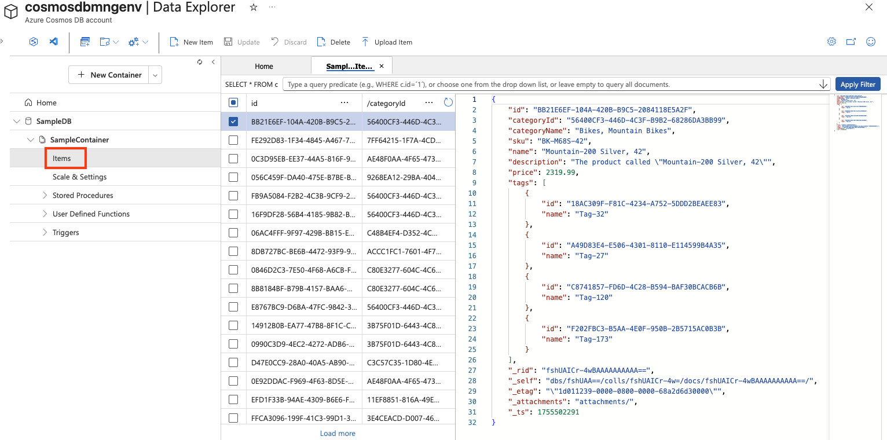

---
lab:
  title: استكشاف Azure Cosmos DB
  module: Explore fundamentals of Azure Cosmos DB
---
# استكشاف Azure Cosmos DB

من خلال إكمال هذا التمرين المعملي، ستتعلم كيفية توفير حساب Azure Cosmos DB، وإنشاء نموذج قاعدة بيانات وحاوية، وإضافة عناصر JSON وعرضها، وتشغيل استعلامات تشبه SQL لاسترداد البيانات. ستكتسب خبرة عملية مع مدخل Microsoft Azure وستفهم كيف يدعم Cosmos DB تخزين البيانات والاستعلام المرن وغير العلائقي.

سيستغرق إكمال هذا التمرين المعملي **15** دقيقة.

## قبل أن تبدأ

ستحتاج إلى [اشتراك Azure](https://azure.microsoft.com/free) حيث تمتلك وصول على المستوى الإداري.

## قم بإنشاء حساب Cosmos DB

لاستخدام Cosmos DB، يجب عليك توفير حساب Cosmos DB في اشتراك Azure الخاص بك. في هذا التمرين، ستوفر حساب Cosmos DB يستخدم Azure Cosmos DB لـ NoSQL.

1. في مدخل Microsoft Azure، حدد **+ Create a resource** في أعلى اليسار، وابحث عن `Azure Cosmos DB`.  في النتائج، حدد "**Azure Cosmos DB**" وحدد "**Create**".

    

1. في اللوحة **Azure Cosmos DB لـ NoSQL**، حدد **Create**.

    
   
    > _**تلميح**: الحساب هو المستوى الأعلى لموارد Cosmos DB. يتيح لك اختيار Azure Cosmos DB for NoSQL تخزين بيانات JSON والاستعلام عنها بلغة استعلام بسيطة تشبه SQL._

1. أدخل التفاصيل التالية، ثم حدد **Review + Create**:
   
    - **نوع** حمل العمل: التعلم
    - **Subscription**: إذا كنت تستخدم بيئة الاختبار المعزولة، حدد *Concierge Subscription*. وإن لم يكن كذلك، حدد اشتراكك في Azure.
    - **Resource group**: إذا كنت تستخدم بيئة الاختبار المعزولة، فحدد مجموعة الموارد الموجودة (والتي سيكون لها اسم مثل *learn-xxxx...*). وإلا، أنشئ مجموعة موارد جديدة باسم من اختيارك.
    - **Account Name**: أدخل اسمًا فريدًا
    - **مناطق** التوفر: تعطيل
    - **Location**: اختر أي موقع موصى به
    - **Capacity mode**: معدل النقل المقدم
    - **Apply Free-Tier Discount**: حدد تطبيق إذا كان ذلك متوفرًا
    - **Limit total account throughput**: غير محدد
  
    > _**لماذا هذه الخيارات؟**_
    >
    > _نحن نضبط **نوع** حمل العمل على Learning لأنه يأتي مع إعدادات افتراضية سهلة للمبتدئين تجعل الإعداد أسهل وتحافظ على انخفاض التكاليف. **يجب أن يكون اسم** حسابك فريدا عبر الخدمة بأكملها، لأنه يصبح جزءا من عنوان URL للخدمة. نحن نختار موقعا **** قريبا منك بحيث يتم تشغيل اختباراتك بشكل أسرع؛ والمواقع التي تراها ستعتمد على اشتراكك وما إذا كانت مناطق توفر معينة ممكنة. بالنسبة لوضع **** السعة، سنعمل على معدل النقل المتوفر بحيث يظل الأداء قابلا للتنبؤ أثناء هذا التمرين المعملي القصير - على الرغم من أن Serverless يمكن أن يكون على ما يرام إذا كنت بحاجة إليه فقط في بعض الأحيان. **إذا كان المستوى** المجاني متوفرا، فسنستخدمه حتى تتمكن من التجربة دون رفع الرسوم. وأخيرا، نحن نبقي إعداد "**الحد الأقصى لمعدل نقل** الحساب" متوقفا عن التشغيل حتى لا يتباطأ أي شيء بشكل غير متوقع أثناء العمل._

1. عند التحقق من صحة التكوين، حدد **Create**.

    > _**تلميح**: سيقدر مدخل Azure المدة التي سيستغرقها توفير هذا المثيل من CosmosDB. يتم حساب وقت الإنشاء المقدر استنادا إلى الموقع الذي حددته._

1. يُرجى الانتظار لاكتمال التوزيع. ثم انتقل إلى المورد الموزع.

## إنشاء نموذج قاعدة البيانات

*خلال هذا الإجراء، أغلق أي تلميحات يتم عرضها في المدخل*.

1. في الصفحة الخاصة بحساب Cosmos DB الجديد، في الجزء n الأيسر، حدد **Data Explorer**.

    

1. في صفحة **Data Explorer**، حدد **Launch quick start**.

    > _**تلميح**: ينشئ البدء السريع قاعدة بيانات عمل وحاوية وعينة بيانات حتى تتمكن من ممارسة إضافة العناصر والاستعلام فيها دون تصميم مخطط أولا._

1. في علامة التبويب **New container**، راجع الإعدادات التي تم ملؤها مسبقا لقاعدة بيانات العينة، ثم حدد **OK**.

1. راقب الحالة في اللوحة الموجودة أسفل الشاشة حتى يتم إنشاء قاعدة بيانات **SampleDB** وحاوية **SampleContainer** (والتي قد تستغرق دقيقة أو نحو ذلك).

## عرض العناصر وإنشائها

1. في الصفحة Data Explorer، قم بتوسيع قاعدة بيانات **SampleDB** وحاوية **SampleContainer**، وحدد **Items** لرؤية قائمة بالعناصر الموجودة في الحاوية. تمثل العناصر بيانات المنتج، ولكل منها مُعرّف فريد وخصائص أخرى.

    

1. حدد أيًا من العناصر الموجودة في القائمة للاطلاع على تمثيل JSON لبيانات العنصر.

1. في أعلى الصفحة، حدد **New Item** لإنشاء عنصر فارغ جديد.

1. قم بتعديل JSON للعنصر الجديد كما يلي، ثم حدد **Save**.

    ```json
   {
       "name": "Road Helmet,45",
       "id": "123456789",
       "categoryID": "123456789",
       "SKU": "AB-1234-56",
       "description": "The product called \"Road Helmet,45\" ",
       "price": 48.74
   }
    ```

    

1. بعد حفظ العنصر الجديد، لاحظ إضافة خصائص بيانات تعريف إضافية تلقائيًا.

    > _**تلميح**: يخزن Cosmos DB العناصر ك JSON (JavaScript Object Notation)، بحيث يمكنك إضافة حقول تناسب السيناريو الخاص بك دون مخطط صارم. `id` يجب أن يكون فريدا داخل الحاوية. بعد الحفظ، يضيف Cosmos DB خصائص النظام (مثل الطوابع الزمنية والمعرفات الداخلية) للمساعدة في إدارة بياناتك وتحسينها:_
    > - *_rid — معرف المورد الداخلي المستخدم من قبل Cosmos DB لتحديد العنصر داخليا.*
    > - *_self — ارتباط المورد الكامل للعنصر.*
    > - *_etag — علامة الكيان المستخدمة لعمليات التحقق من التزامن المتفائل.*
    > - *_ts — الطابع الزمني Unix (بالثوان) عند آخر تعديل للعنصر.*
    > - *_attachments — ارتباط إلى مرفقات المستند (إن وجد).*

## الاستعلام عن قاعدة البيانات

1. في الصفحة **Data Explorer**، حدد أيقونة **New SQL Query**.

    

1. في محرر الاستعلام SQL، راجع الاستعلام الافتراضي (`SELECT * FROM c`) واستخدم الزر **Execute Query** لتشغيله.

1. راجع النتائج، والتي تتضمن تمثيل JSON الكامل لجميع العناصر.

1. تغيير الاستعلام كما يلي:

    ```sql
   SELECT *
   FROM c
   WHERE CONTAINS(c.name,"Helmet")
    ```

    > _**تلميح**: تستخدم واجهة برمجة تطبيقات NoSQL استعلامات مألوفة تشبه SQL للبحث في مستندات JSON. `SELECT * FROM c` تسرد جميع العناصر وعوامل `CONTAINS` التصفية حسب النص داخل خاصية - مفيدة لعمليات البحث السريعة دون إعداد إضافي._

1. استخدم زر **تنفيذ الاستعلام** لتشغيل الاستعلام المعدل ومراجعة النتائج، والتي تتضمن كيانات JSON لأي عناصر تحتوي على حقل **اسم** يحتوي على النص "Helmet".

    

1. أغلق محرر استعلام SQL، مع تجاهل التغييرات.

    لقد رأيت كيفية إنشاء كيانات JSON والاستعلام عنها في قاعدة بيانات Cosmos DB باستخدام واجهة مستكشف البيانات في مدخل Azure. في سيناريو حقيقي، سيستخدم مطور تطبيقات واحدة من العديد من مجموعات تطوير البرامج (SDKs) الخاصة بلغة البرمجة لاستدعاء واجهة برمجة التطبيقات NoSQL والعمل مع البيانات الموجودة في قاعدة البيانات.

> _**تلميح**: إذا انتهيت من استكشاف Azure Cosmos DB، يمكنك حذف مجموعة الموارد التي قمت بإنشائها في هذا التمرين._
