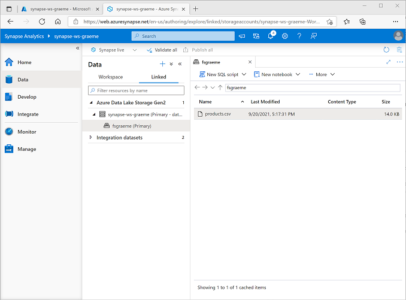

---
lab:
  title: استكشاف تحليلات البيانات في Azure باستخدام Azure Synapse Analytics
  module: Explore fundamentals of large-scale data warehousing
---

# <a name="explore-data-analytics-in-azure-with-azure-synapse-analytics"></a>استكشاف تحليلات البيانات في Azure باستخدام Azure Synapse Analytics

في هذا الإجراء، ستقوم بتوفير وظيفة مساحة عمل Azure Synapse Analytics في اشتراكك في Azure، واستخدامها لمعالجة البيانات وتحريها.

سيستغرق إكمال هذا التمرين المعملي **30** دقيقة.

## <a name="before-you-start"></a>قبل البدء

ستحتاج إلى [اشتراك Azure](https://azure.microsoft.com/free) حيث تمتلك وصول على المستوى الإداري.

## <a name="provision-an-azure-synapse-analytics-workspace"></a>توفير مساحة عمل Azure Synapse Analytics

لاستخدام Azure Synapse Analytics، يجب توفير مورد مساحة عمل Azure Synapse Analytics في اشتراك Azure.

1. افتح مدخل Microsoft Azure على [https://portal.azure.com](https://portal.azure.com?azure-portal=true)، وقم بتسجيل الدخول باستخدام حساب Microsoft المقترن باشتراك Azure.

    >                 **تلميح**: تأكد من أنك تعمل في الدليل الذي يحتوي على اشتراكك - المُشار إليه في أعلى اليمين أسفل معرّف مستخدمك. إذا لم تكن كذلك، حدد رمز المستخدم وبدّل الدليل.

2. في مدخل Microsoft Azure، في صفحة **"Home"**، استخدم **&#65291; إنشاء رمز مورد** لإنشاء مورد جديد.
3. ابحث عن *Azure Synapse Analytics*، وإنشاء مورد **Azure Synapse Analytics** جديد باستخدام الإعدادات التالية:
    - **الاشتراك**: *اشتراكك في Azure*
        - **Resource group**: *إنشاء مجموعة موارد جديدة ذات اسم فريد مثل "synapse-rg"*
        - **مجموعة الموارد المُدارة**: *أدخل اسماً مناسباً، على سبيل المثال "synapse-managed-rg"*.
    - **Workspace name**: *أدخل اسماً فريداً لمساحة العمل، على سبيل المثال "synapse-ws-<your_name>"* .
    - **«المنطقة»**: *حدد أيا من المناطق التالية*:
        - شرق أستراليا
        - وسط الولايات المتحدة
        - East US 2
        - شمال أوروبا
        - جنوب وسط الولايات المتحدة
        - جنوب شرق آسيا
        - جنوب المملكة المتحدة
        - غرب أوروبا
        - غرب الولايات المتحدة
        - WestUS 2
    - **حدد "Data Lake Storage Gen 2"**: من الاشتراك
        - **اسم الحساب**: *إنشاء حساب جديد باسم فريد، على سبيل المثال "<your_name> datalake"*.
        - **اسم نظام الملفات**: *إنشاء نظام ملفات جديد باسم فريد، على سبيل المثال "fs<your_name>"*.

    >                 **ملاحظة**: تتطلب مساحة عمل Synapse Analytics مجموعتين من الموارد في اشتراك Azure، مجموعة للموارد التي تُنشئها صراحةً وأخرى للموارد المُدارة التي تستخدمها الخدمة. كما يتطلب حساب تخزين مستودع بيانات لتخزين البيانات والبرامج النصية والبيانات الاصطناعية الأخرى.

4. عند إدخال هذه التفاصيل، حدد **"Review + create"**، ثم حدد **"Create"** لإنشاء مساحة العمل.
5. انتظر حتى يتم إنشاء مساحة العمل - قد يستغرق ذلك خمس دقائق أو نحو ذلك.
6. عند اكتمال التوزيع انتقل إلى مجموعة الموارد التي تم إنشاؤها ولاحظ أنه يحتوي على مساحة عمل Synapse Analytics وحساب تخزين مستودع البيانات.
7. حدد مساحة عمل Synapse، وفي صفحة **"Overview"** الخاصة بها، في بطاقة **"Open Synapse Studio"**، حدد **"Open"** لفتح Synapse Studio في علامة تبويب متصفح جديدة. Synapse Studio هي واجهة قائمة على الويب يمكنك استخدامها للعمل مع مساحة عمل Synapse Analytics.
8. على الجانب الأيسر من استوديو Synapse، استخدم الرمز **&rsaquo;&rsaquo;** لتوسيع القائمة - وهذا يكشف عن الصفحات المختلفة داخل Synapse Studio التي ستستخدمها لإدارة الموارد وتنفيذ مهام تحليل البيانات، كما هو موضح هنا:

    

## <a name="ingest-data"></a>استيعاب البيانات

واحدة من المهام الرئيسية التي يمكنك القيام بها مع Azure Synapse Analytics هي تحديد *البنية الأساسية لبرنامج ربط العمليات التجارية* التي تنقل (وإذا لزم الأمر، تُحوّل) البيانات من مجموعة واسعة من المصادر إلى مساحة العمل الخاصة بك للتحليل.

1. في Synapse Studio، في الصفحة **Home**، حدد **Ingest** لفتح أداة **Copy Data**.
2. في أداة Copy Data، في خطوة **"Properties"**، تأكد من تحديد **"Built-in copy task"** و **"Run once now"**، ثم انقر فوق **"Next >"**.
3. في خطوة **"Source"** في الخطوة الفرعية **"Dataset"** حدد الإعدادات التالية:
    - **Source type**: الكل
    - **Connection**: *أنشئ اتصالاً جديدًا، وفي جزء **New connection** الذي يظهر، في علامة التبويب **File**، حدد **HTTP**. ثم تابع وأنشئ اتصالاً بملف بيانات باستخدام الإعدادات التالية:*
        - **"Name"**: منتجات شركة مغامرة
        - **"Description"**: قائمة المنتجات عبر HTTP
        - **"Connect via integration runtime"**: AutoResolveIntegrationRuntime
        - **"Base URL"**: `https://raw.githubusercontent.com/MicrosoftLearning/DP-900T00A-Azure-Data-Fundamentals/master/Azure-Synapse/products.csv`
        - **"Server Certificate Validation"**: تمكين
        - **"Authentication type"**: مجهول
4. بعد إنشاء الاتصال، على الخطوة الفرعية **"Source/Dataset"** تأكد من تحديد الإعدادات التالية، ثم حدد **"Next >"**:
    - **"Source/Dataset"**: *اتركه فارغاً*
    - **طريقة الطلب**: GET
    - **عناوين إضافية**: *اتركه فارغاً*
    - **نسخة ثنائية**: <u>غير</u> مُحدد
    - **مُهلة الطلب**: *اتركه فارغاً*
    - **أقصى الاتصالات المتزامنة**: *اتركه فارغاً*
5. في خطوة **"Source"** في الخطوة الفرعية **"Configuration"** حدد **"Preview data"** لرؤية معاينة بيانات المنتج التي سيتم استيعابها في البنية الأساسية لبرنامج ربط العمليات التجارية، ثم أغلق المعاينة.
6. بعد معاينة البيانات، في خطوة **"Source/Configuration"** الفرعية تأكد من تحديد الإعدادات التالية، ثم حدد **"Next >"**:
    - **File format**: DelimitedText
    - **عمود محدِّد**: فاصلة (،)
    - **صف محدِّد**: موجز الخط (\n)
    - **"First row as header"**: محدَّد
    - **"Compression type"**: بلا
7. في خطوة **"Destination"** في الخطوة الفرعية **"Dataset"** حدد الإعدادات التالية:
    - **Destination type**: Azure Data Lake Storage Gen 2
    - **Connection**: *حدد الاتصال الموجود بمخزن مستودع البيانات (تم إنشاء هذا لك عند إنشاء مساحة العمل).*
8. بعد تحديد الاتصال، في الخطوة "**Destination/Dataset**" تأكد من تحديد الإعدادات التالية، ثم حدد "**Next >** ":
    - **مسار الملف**: *استعرض للوصول إلى مجلد نظام الملفات*
    - **اسم الملف**: منتجات.csv
    - **سلوك النسخ**: بلا
    - **أقصى الاتصالات المتزامنة**: *اتركه فارغاً*
    - **حجم الكتلة (ميغا بايت)**: *اتركه فارغاً*
9. في خطوة **"Destination"** في الخطوة الفرعية **"Configuration"** تأكد من تحديد الخصائص التالية. ثم حدد **"Next >"**:
    - **File format**: DelimitedText
    - **عمود محدِّد**: فاصلة (،)
    - **صف محدِّد**: موجز الخط (\n)
    - **"Add header to file"**: مُحدَّد
    - **"Compression type"**: بلا
    - **"Max rows per file"**: *اتركه فارغاً*
    - **"File name prefix"**: *اتركه فارغاً*
10. في خطوة **"Settings"** أدخل الإعدادات التالية ثم انقر فوق **"Next >"**:
    - **اسم المهمة**: نسخ المنتجات
    - **وصف المهمة** نسخ بيانات المنتجات
    - **التسامح مع الخطأ**: *اتركه فارغاً*
    - **تمكين التسجيل**: <u>إلغاء</u> التحديد
    - **تمكين التشغيل المرحلي**: <u>إلغاء</u> التحديد
11. في خطوة **"Review and finish"** في الخطوة الفرعية **"Review"** اقرأ الملخص ثم انقر فوق **"Next >"**.
12. في خطوة **"Deployment"** الفرعية، انتظر البنية الأساسية لبرنامج ربط العمليات التجارية لتُوزّع، ثم انقر فوق **"Finish"** .
13. في Synapse Studio، حدد صفحة "**Monitor**"، وفي علامة التبويب "**Pipeline runs**"، انتظر حتى اكتمال البنية الأساسية لبرنامج ربط العمليات التجارية "**Copy products**" بحالة "**Succeeded**" (يمكنك استخدام الزر " **&#8635; Refresh**" في صفحة "Pipeline runs" لتحديث الحالة).
14. في صفحة **"Data"** حدد علامة التبويب **"Linked"** ثم قم بتوسيع التدرج الهرمي **Azure Data Lake Storage Gen 2** حتى تشاهد تخزين الملف لمساحة عمل Synapse. ثم حدد تخزين الملف للتحقق من نسخ ملف اسمه **products.csv** إلى هذا الموقع، كما هو موضح هنا:

    

## <a name="use-a-sql-pool-to-analyze-data"></a>استخدام تجمع SQL لتحليل البيانات

الآن بعد أن قمت باستيعاب بعض البيانات في مساحة العمل الخاصة بك، يمكنك استخدام Synapse Analytics للاستعلام عنها وتحليلها. واحدة من الطرق الأكثر شيوعاً للاستعلام عن البيانات هي استخدام SQL، وفي Synapse Analytics يمكنك استخدام *تجمّع SQL* لتشغيل التعليمات البرمجية لـ SQL.

1. في Synapse Studio، انقر بزر الماوس الأيمن فوق ملف **"products.csv"** في تخزين الملفات لمساحة عمل Synapse، أشر إلى **البرنامج النصي SQL الجديد**وحدد **"Select TOP 100 rows"**.
2. في جزء **SQL Script 1** الذي يفتح، راجع التعليمات البرمجية لـ SQL التي تم إنشاؤها، والتي يجب أن تكون مشابهة لهذا:

    ```SQL
    -- This is auto-generated code
    SELECT
        TOP 100 *
    FROM
        OPENROWSET(
            BULK 'https://datalakexx.dfs.core.windows.net/fsxx/products.csv',
            FORMAT = 'CSV',
            PARSER_VERSION='2.0'
        ) AS [result]
    ```

    يفتح هذا الرمز مجموعة سجلات من الملف النصي الذي قمت باستيراده ويسترد أول 100 سجل من البيانات.

3. في قائمة **الاتصال بـ**، تأكد من تحديد **"Built-in"** - يمثل هذا تجمّع SQL المُدمج الذي تم إنشاؤه باستخدام مساحة العمل الخاصة بك.
4. على شريط الأدوات، استخدم الزر **"&#9655; Run"** لتشغيل التعليمات البرمجية لـ SQL، ومراجعة النتائج، والتي يجب أن تبدو مشابهة لهذا:

    | C1 | c2 | c3 | c4 |
    | -- | -- | -- | -- |
    | ProductID | ProductName | الفئة | ListPrice |
    | 771 | Mountain-100 Silver, 38 | Mountain Bikes | 3399.9900 |
    | 772 | Mountain-100 Silver, 42 | Mountain Bikes | 3399.9900 |
    | ... | ... | ... | ... |

5. لاحظ أن النتائج تتكون من أربعة أعمدة تسمى C1 وC2 وC3 وC4؛ وأن الصف الأول في النتائج يحتوي على أسماء حقول البيانات. لحل هذه المشكلة، قم بإضافة معلمات HEADER_ROW = TRUE إلى الدالة OPENROWSET كما هو موضح هنا (استبدال *datalakexx* و*fsxx* بأسماء حساب تخزين مستودع البيانات ونظام الملفات)، ثم قم بإعادة تشغيل الاستعلام:

    ```SQL
    SELECT
        TOP 100 *
    FROM
        OPENROWSET(
            BULK 'https://datalakexx.dfs.core.windows.net/fsxx/products.csv',
            FORMAT = 'CSV',
            PARSER_VERSION='2.0',
            HEADER_ROW = TRUE
        ) AS [result]
    ```

    الآن تبدو النتائج كما يلي:

    | ProductID | ProductName | الفئة | ListPrice |
    | -- | -- | -- | -- |
    | 771 | Mountain-100 Silver, 38 | Mountain Bikes | 3399.9900 |
    | 772 | Mountain-100 Silver, 42 | Mountain Bikes | 3399.9900 |
    | ... | ... | ... | ... |

6. تعديل الاستعلام كما يلي (استبدال *datalakexx* و*fsxx* بأسماء حساب تخزين مستودع البيانات ونظام الملفات):

    ```SQL
    SELECT
        Category, COUNT(*) AS ProductCount
    FROM
        OPENROWSET(
            BULK 'https://datalakexx.dfs.core.windows.net/fsxx/products.csv',
            FORMAT = 'CSV',
            PARSER_VERSION='2.0',
            HEADER_ROW = TRUE
        ) AS [result]
    GROUP BY Category;
    ```

7. تشغيل الاستعلامات المعدّلة التي يجب أن يعرض مجموعة النتائج التي تحتوي على عدد المنتجات في كل فئة، مثل هذا:

    | الفئة | عدد المنتجات |
    | -- | -- |
    | Bib-Shorts | 3 |
    | Bike Racks | 1 |
    | ... | ... |

8. في جزء **"Properties"** لـ **البرنامج النصي 1 SQL**، قم بتغيير **الاسم** إلى **عدد المنتجات حسب الفئة**. ثم في شريط الأدوات، حدد **"Publish"** لحفظ البرنامج النصي.

9. أغلق جزء البرنامج النصي **"Count Products by Category"**.

10. في استوديو Synapse، حدد الصفحة **"Develop"** ولاحظ أنه تم حفظ البرنامج النصي SQL **عدد منتجات المنشورة حسب الفئة** هناك.

11. حدد البرنامج النصي SQL **"Count Products by Category"** لإعادة فتحه. ثم تأكد من أن البرنامج النصي متصل بتجمّع SQL **المُضمن** وتشغيله لاسترداد عدد المنتجات.

12. في جزء **"Results"** حدد طريقة عرض **"Chart"** ثم حدد الإعدادات التالية للتخطيط:
    - **نوع المخطط**: عمود
    - **فئة العمود**: الفئة
    - **أعمدة وسيلة الإيضاح (السلسلة)**: عدد المنتجات
    - **موقف وسيلة الإيضاح**: أسفل - وسط
    - **تسمية وسيلة الإيضاح**: *اتركه فارغاً*
    - **القيمة الصغرى لوسيلة الإيضاح (السلسلة)**: *اتركه فارغاً*
    - **القيمة الكبرى لوسيلة الإيضاح (السلسلة)**: *اتركه فارغاً*
    - **تسمية الفئة**: *اتركه فارغاً*

    يجب أن يشبه المخطط الناتج هذا:

    

## <a name="use-a-spark-pool-to-analyze-data"></a>استخدام تجمع Spark لتحليل البيانات

في حين أن SQL هي لغة شائعة للاستعلام عن مجموعات البيانات المُنظمة، يجد العديد من محللي البيانات لغات مثل Python مفيدة لاستكشاف وإعداد البيانات للتحليل. في تحليلات Azure Synapse، يمكنك تشغيل رمز Python (وغيره) في *تجمّع Spark*؛ الذي يستخدم محرك معالجة البيانات الموزعة على أساس Apache Spark.

1. في استوديو Synapse، حدد صفحة **"Manage"**.
2. حدد علامة التبويب **"Apache Spark pools"** ثم استخدم رمز **&#65291، جديد** لإنشاء تجمّع Spark جديد بالإعدادات التالية:
    - **اسم وعاء Apache Spark **: spark
    - **حجم عقدة المجموعة**: الذاكرة محسنة
    - **حجم العقدة**: صغير (4 vCores / 32 GB)
    - **تحجيم تلقائي**: ُممكّن
    - **عدد العقد** 3----3
3. مراجعة وإنشاء تجمّع Spark ثم انتظر حتى عملية التوزيع (التي قد تستغرق بضع دقائق).
4. عند توزيع تجمّع Spark في Synapse Studio على صفحة **"Data"** استعرض للوصول إلى نظام الملفات لمساحة عمل Synapse. ثم انقر بزر الماوس الأيمن فوق **"products.csv"**، أشر إلى **"New notebook"**، وحدد **"Load to DataFrame"**.
5. في جزء **"Notebook 1"** الذي يفتح، في القائمة **"Attach to"** حدد تجمع **"spark"** المُنشأ مسبقاً وتأكد من تعيين **اللغة** إلى **PySpark (Python)**.
6. راجع التعليمات البرمجية في الخلية الأولى (والوحيدة) في دفتر الملاحظات، والتي يجب أن تبدو كما يلي:

    ```Python
    %%pyspark
    df = spark.read.load('abfss://fsxx@datalakexx.dfs.core.windows.net/products.csv', format='csv'
    ## If header exists uncomment line below
    ##, header=True
    )
    display(df.limit(10))
    ```

7.  حدد " **&#9655; Run**" الموجود يسار الخلية البرمجية لتشغيله، وانتظر النتائج. في المرة الأولى التي تقوم فيها بتشغيل خلية في دفتر ملاحظات، يتم بدء تشغيل تجمّع Spark - لذلك قد يستغرق الأمر دقيقة أو نحو ذلك لإرجاع أي نتائج.

    > **ملاحظة**: في حالة حدوث خطأ بسبب عدم توفر Python Kernel بعد، أعد تشغيل الخلية.

8. في نهاية المطاف، يجب أن تظهر النتائج أسفل الخلية، ويجب أن تكون مشابهة لهذا:

    | _c0_ | _c1_ | _c2_ | _c3_ |
    | -- | -- | -- | -- |
    | ProductID | ProductName | الفئة | ListPrice |
    | 771 | Mountain-100 Silver, 38 | Mountain Bikes | 3399.9900 |
    | 772 | Mountain-100 Silver, 42 | Mountain Bikes | 3399.9900 |
    | ... | ... | ... | ... |

9. إلغاء اتصال خط *header=True* (لأن الملف products.csv يحتوي على رؤوس الأعمدة في السطر الأول)، بحيث تبدو التعليمات البرمجية الخاصة بك كما يلي:

    ```Python
    %%pyspark
    df = spark.read.load('abfss://fsxx@datalakexx.dfs.core.windows.net/products.csv', format='csv'
    ## If header exists uncomment line below
    , header=True
    )
    display(df.limit(10))
    ```

10. أعد تشغيل الخلية وتحقق من أن النتائج تبدو كما يلي:

    | ProductID | ProductName | الفئة | ListPrice |
    | -- | -- | -- | -- |
    | 771 | Mountain-100 Silver, 38 | Mountain Bikes | 3399.9900 |
    | 772 | Mountain-100 Silver, 42 | Mountain Bikes | 3399.9900 |
    | ... | ... | ... | ... |

    لاحظ أن تشغيل الخلية مرة أخرى يستغرق وقتاً أقل، لأن تجمع Spark قد بدأ بالفعل.

11. ضمن النتائج، استخدم رمز **"التعليمة &#65291;"** لإضافة خلية تعليمة برمجية جديدة إلى دفتر الملاحظات.
12. في خلية التعليمات البرمجية الفارغة الجديدة، أضف التعليمات البرمجية التالية:

    ```Python
    df_counts = df.groupBy(df.Category).count()
    display(df_counts)
    ```

13. حدد " **&#9655; Run**" الموجود على اليسار لتشغيل خلية التعليمات البرمجية الجديدة، وراجع النتائج التي يجب أن تبدو مشابهة لهذا:

    | الفئة | العدد |
    | -- | -- |
    | سماعة الرأس | 3 |
    | عجلات | 14 |
    | ... | ... |

14. في إخراج النتائج للخلية، حدد طريقة عرض **المخطط**. يجب أن يشبه المخطط الناتج هذا:

    

15. أغلق جزء **Notebook 1** وتجاهل التغييرات.

## <a name="delete-azure-resources"></a>حذف موارد Azure

إذا انتهيت من استكشاف Azure Synapse Analytics، يجب حذف الموارد التي أنشأتها لتجنب تكاليف Azure غير الضرورية.

1. أغلق علامة التبويب مستعرض Studio browser ثم العودة إلى مدخل Microsoft Azure.
2. في مدخل Microsoft Azure، في الصفحة ⁧**الرئيسية**⁩، حدّد ⁧ **"Resource groups"⁦⁩⁧**⁩.
3. حدد مجموعة الموارد لمساحة عمل Synapse Analytics (وليس مجموعة الموارد المدارة)، وتحقق من أنها تحتوي على مساحة عمل Synapse وحساب التخزين وتجمّع Spark لمساحة العمل.
4. في أعلى صفحة **"Overview"** لمجموعة الموارد، حدد **"Delete resource group"**.
5. أدخل اسم مجموعة الموارد لتأكيد رغبتك في حذفه، ثم حدد **"Delete"**.

    بعد بضع دقائق، سيتم حذف مساحة عمل Azure Synapse ومساحة العمل المُدارة المقترنة بها.
