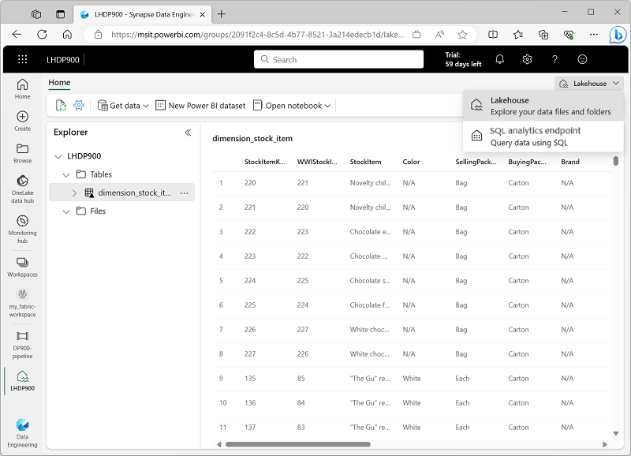

---
lab:
  title: استكشاف تحليلات البيانات في Microsoft Fabric
  module: Explore fundamentals of large-scale data analytics
---

# استكشاف تحليلات البيانات في Microsoft Fabric

في هذا التمرين، ستستكشف استيعاب البيانات وتحليلاتها في Microsoft Fabric Lakehouse.

سيستغرق إكمال هذا التمرين المعملي **25** دقيقة.

> **ملاحظة**: ستحتاج إلى ترخيص Microsoft Fabric لإكمال هذا التمرين. راجع [بدء استخدام Fabric](https://learn.microsoft.com/fabric/get-started/fabric-trial) للحصول على تفاصيل حول كيفية تمكين ترخيص تجريبي مجاني لـ Fabric. ستحتاج إلى حساب Microsoft الخاص بـ *المؤسسة التعليمية* أو *العمل* للقيام بذلك. إذا لم يكن لديك حساب، فيمكنك [التسجيل للحصول على إصدار تجريبي من Microsoft Office 365 E3 أو إصدار أحدث](https://www.microsoft.com/microsoft-365/business/compare-more-office-365-for-business-plans).

## إنشاء مساحة عمل

قبل العمل مع البيانات في Fabric، قُم بإنشاء مساحة عمل مع تمكين الإصدار التجريبي لـ Fabric.

1. سجل الدخول إلى [Microsoft Fabric](https://app.fabric.microsoft.com) على `https://app.fabric.microsoft.com`.
2. في شريط القوائم على اليسار، حدد **مساحات العمل** (تبدو الأيقونة مشابهة لـ ).
3. أنشئ مساحة عمل جديدة باسم من اختيارك، مع تحديد وضع ترخيص في قسم **المتقدمة** يتضمن سعة Fabric (*الإصدار التجريبي* أو *Premium* أو *Fabric*).
4. عند فتح مساحة العمل الجديدة، يجب أن تكون فارغة.

    

## إنشاء مستودع

الآن بعد أن أصبح لديك مساحة عمل، حان الوقت للتبديل إلى تجربة *هندسة البيانات* في المدخل وإنشاء مستودع بيانات لملفات البيانات الخاصة بك.

1. في الجزء السفلي الأيسر من المدخل، قُم بالتبديل إلى تجربة **هندسة البيانات**.

    

    تتضمن الصفحة الرئيسية لهندسة البيانات لوحات لإنشاء أصول هندسة البيانات شائعة الاستخدام.

2. في الصفحة الرئيسية لـ **هندسة البيانات**، أنشئ **مستودعًا** جديدًا باسم من اختيارك.

    بعد دقيقة أو نحو ذلك، سيتم إنشاء مستودعًا جديدًا:

    

3. أعرض المستودع الجديدة، ولاحظ أن جزء **مُستكشف المستودع** على اليسار يُمكنك من استعراض الجداول والملفات في المستودع:
    - يحتوي مجلد **الجداول** على جداول يمكنك الاستعلام عنها باستخدام SQL. تستند الجداول في مستودع Microsoft Fabric إلى تنسيق ملف مصدر مفتوح *Delta Lake*، المستخدم عادة في Apache Spark.
    - يحتوي مجلد **الملفات** على ملفات بيانات في تخزين OneLake للمستودع غير المقترن بجداول دلتا المدارة. يمكنك أيضا إنشاء *اختصارات* في هذا المُجلد للإشارة إلى البيانات المخزنة خارجيًا.

    حاليًا، لا توجد جداول أو ملفات في المستودع.

## استيعاب البيانات

طريقة بسيطة لاستيعاب البيانات هي استخدام نشاط **نسخ البيانات** في مسار لاستخراج البيانات من مصدر ونسخها إلى ملف في المستودع.

1. في **الصفحة الرئيسية** للمستودع الخاص بك، في قائمة **احصل على البيانات**، حدد **مسار بيانات جديد**، وأنشئ مسار بيانات جديد باسم **Ingest Sales Data**.
1. في معالج **نسخ البيانات** ، في صفحة **اختيار مصدر البيانات**، حدد **نموذج بيانات البيع بالتجزئة من مجموعة بيانات نموذج Wide World Importers** .

    

1. حدد **التالي** واعرض الجداول في مصدر البيانات على صفحة **الاتصال بمصدر البيانات**.
1. حدد جدول **dimension_stock_item**، الذي يحتوي على سجلات المنتجات. ثُم حدد **التالي** للتقدم إلى صفحة **اختيار وجهة البيانات**.
1. في صفحة **اختيار وجهة البيانات**، حدد مستودعك الحالي. بعد ذلك حدد **التالي**.
1. قُم بتعيين خيارات وجهة البيانات التالية، ثم حدد **التالي**:
    - **المجلد الجذر**: الجداول
    - **إعدادات التحميل**: تحميل إلى جدول جديد
    - **إسم الجدول الوجهة**: dimension_stock_item
    - **تعيينات الأعمدة**: *اترك التعيينات الافتراضية كما هي*
    - **تمكين التقسيم**: *غير محدد*
1. في صفحة **مراجعة + حفظ**، تأكد من تحديد الخيار **ابدأ بنقل البيانات على الفور**، ثم حدد **حفظ + تشغيل**.

    يتم إنشاء مسار جديد يحتوي على نشاط **نسخ البيانات**، كما هو موضح هنا:

    

    عند بدء تشغيل المسار، يُمكنك مراقبة حالته في جزء **الإخراج** ضمن مُصمم المسار. استخدم الأيقونة **↻** (*تحديث*) لتحديث الحالة، وانتظر حتى ينجح الأمر.

1. في شريط قائمة المركز على اليسار، حدد المستودع الخاص بك.
1. في **الصفحة الرئيسية** ، في جزء **مستكشف المستودع**، قُم بتوسيع **الجداول** وتحقق من إنشاء جدول **dimension_stock_item**.

    > **ملاحظة**: إذا كان الجدول الجديد مُدرجًا على أنه *غير معروف*، فاستخدم الزر **تحديث** في شريط أدوات المستودع لتحديث طريقة العرض.

1. حدد الجدول **dimension_stock_item** لعرض محتوياته.

    

## الاستعلام عن البيانات في مستودع

الآن بعد أن قُمت باستيعاب البيانات في جدول في مستودع، يُمكنك استخدام SQL للاستعلام عنها.

1. في الجزء العلوي الأيمن من صفحة Lakehouse، عليك التبديل إلى **نقطة نهاية تحليلات SQL** الخاصة بـ Lakehouse الخاص بك.

    

1. في شريط الأدوات، حدد **استعلام SQL جديد**. ثم أدخل كود SQL التالي في محرر الاستعلام:

    ```sql
    SELECT Brand, COUNT(StockItemKey) AS Products
    FROM dimension_stock_item
    GROUP BY Brand
    ```

1. حدد الزر **▷ تشغيل** لتشغيل الاستعلام ومراجعة النتائج، والتي يجب أن تكشف عن وجود قيمتين للعلامة التجارية (*N/A* و *Northwind*) وإظهار عدد المنتجات في كل منها.

    

## تصور البيانات في مستودع

تنظم مستودعات Microsoft Fabric Lakehouse كافة الجداول في نموذج بيانات دلالية، والذي يمكنك استخدامه لإنشاء تصورات وتقارير.

1. في أسفل يسار الصفحة، ضمن جزء **المستكشف**، حدد علامة التبويب **نموذج** لمشاهدة نموذج البيانات للجداول في المستودع (في هذه الحالة يوجد جدول واحد فقط).

    

1. في شريط الأدوات، حدد **تقرير جديد** لفتح علامة تبويب مستعرض جديدة تحتوي على مُصمم تقارير Power BI.
1. في مُصمم التقرير:
    1. في جزء **البيانات**، قُم بتوسيع جدول **dimension_stock_item** وحدد حقلي **العلامة التجارية** و **StockItemKey**.
    1. في جزء **المرئيات**، حدد مرئيات **المخطط الشريطي المكدس** (إنه أول مخطط مُدرج). ثم تأكد من أن **المحور Y** يحتوي على حقل **العلامة التجارية** وقم بتغيير التجميع في **المحور X** إلى **العدد** بحيث يحتوي على حقل **عدد الـ StockItemKey**. وأخيرا، قُم بتغيير حجم المرئيات في لوحة التقرير لملء المساحة المتوفرة.

        

    > **تلميح**: يُمكنك استخدام أيقونات **>>** لإخفاء أجزاء مُصمم التقرير لرؤية التقرير بشكل أكثر وضوحًا.

1. في القائمة **الملف**، حدد **حفظ** لحفظ التقرير على أنه**تقرير كمية العلامة التجارية** في مساحة عمل Fabric الخاصة بك.

    يمكنك الآن إغلاق علامة تبويب المتصفح التي تحتوي على التقرير للعودة إلى المستودع الخاص بك. يمكنك العثور على التقرير في صفحة مساحة العمل الخاصة بك في مدخل Microsoft Fabric.

## تنظيف الموارد

إذا انتهيت من استكشاف Microsoft Fabric، يمكنك حذف مساحة العمل التي أنشأتها لهذا التمرين.

1. في الشريط على اليسار، حدد أيقونة مساحة العمل لعرض كافة العناصر التي تحتوي عليها.
2. في القائمة **...** على شريط الأدوات، حدد **إعدادات مساحة العمل**.
3. في قسم **الأخرى**، حدد **إزالة مساحة العمل هذه**.
