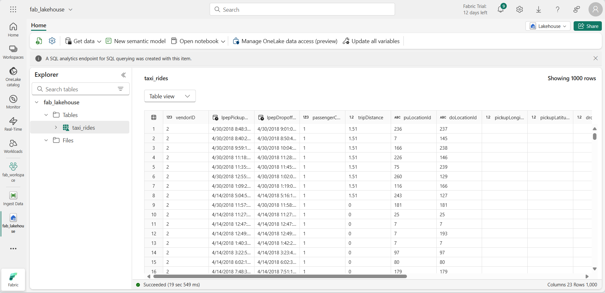

---
lab:
  title: استكشاف تحليلات البيانات في Microsoft Fabric
  module: Explore fundamentals of large-scale data analytics
---

# استكشاف تحليلات البيانات في Microsoft Fabric

في هذا التمرين، ستستكشف استيعاب البيانات وتحليلاتها في Microsoft Fabric Lakehouse.

من خلال إكمال هذا المعمل، سوف:

- **فهم مفاهيم** Microsoft Fabric Lakehouse: تعرف على كيفية إنشاء مساحات عمل وبحيرات، والتي تعتبر أساسية لتنظيم أصول البيانات وإدارتها في Fabric.
- **استيعاب البيانات باستخدام البنية الأساسية لبرنامج ربط** العمليات التجارية: استخدم البنية الأساسية لبرنامج ربط العمليات التجارية الموجهة لجلب البيانات الخارجية إلى المستودع، ما يجعلها جاهزة للاستعلام دون ترميز يدوي.
- **استكشاف البيانات والاستعلام عنها باستخدام SQL**: تحليل البيانات التي تم استيعابها باستخدام استعلامات SQL المألوفة، والحصول على رؤى مباشرة داخل Fabric.
- **إدارة الموارد**: تعرف على أفضل الممارسات لتنظيف الموارد لتجنب الرسوم غير الضرورية.

## الخلفية على مجموعة بيانات سيارات الأجرة في مدينة نيويورك:

تحتوي مجموعة بيانات "سيارة أجرة نيويورك - أخضر" على سجلات مفصلة لرحلات سيارات الأجرة في مدينة نيويورك، بما في ذلك أوقات الاستلام والإسقاط، والمواقع، ومسافات الرحلات، والأجور، وعدد الركاب. ويستخدم على نطاق واسع في تحليلات البيانات والتعلم الآلي لاستكشاف التنقل الحضري والتنبؤ بالطلب واكتشاف الحالات الشاذة. في هذا التمرين المعملي، ستستخدم مجموعة البيانات في العالم الحقيقي هذه لممارسة استيعاب البيانات وتحليلها في Microsoft Fabric.

سيستغرق إكمال هذا التمرين المعملي **25** دقيقة.

> **ملاحظة**: ستحتاج إلى ترخيص Microsoft Fabric لإكمال هذا التمرين. راجع [بدء استخدام Fabric](https://learn.microsoft.com/fabric/get-started/fabric-trial) للحصول على تفاصيل حول كيفية تمكين ترخيص تجريبي مجاني لـ Fabric. ستحتاج إلى حساب Microsoft الخاص بـ *المؤسسة التعليمية* أو *العمل* للقيام بذلك. إذا لم يكن لديك حساب، فيمكنك [التسجيل للحصول على إصدار تجريبي من Microsoft Office 365 E3 أو إصدار أحدث](https://www.microsoft.com/microsoft-365/business/compare-more-office-365-for-business-plans).

*في المرة الأولى التي تستخدم فيها أي ميزات من ميزات Microsoft Fabric، قد تظهر المطالبات بالتلميحات. تجاهل هذه.*

## إنشاء مساحة عمل

قبل العمل مع البيانات في Fabric، قُم بإنشاء مساحة عمل مع تمكين الإصدار التجريبي لـ Fabric.

> _**تلميح**: مساحة العمل هي الحاوية الخاصة بك لجميع الأصول (lakehouses، البنية الأساسية لبرنامج ربط العمليات التجارية، دفاتر الملاحظات، التقارير). يتيح تمكين سعة النسيج تشغيل هذه العناصر._

1. انتقل إلى الصفحة[ الرئيسية ل ](https://app.fabric.microsoft.com/home?experience=fabric)Microsoft Fabric في `https://app.fabric.microsoft.com/home?experience=fabric` مستعرض، وسجل الدخول باستخدام بيانات اعتماد Fabric.

1. في شريط القوائم على اليسار، حدد **مساحات العمل** (تبدو الأيقونة مشابهة لـ ).

    

1. أنشئ مساحة عمل جديدة باسم من اختيارك، مع تحديد وضع ترخيص في قسم **المتقدمة** يتضمن سعة Fabric (*الإصدار التجريبي* أو *Premium* أو *Fabric*).

    > _**تلميح** يؤدي تحديد سعة تتضمن Fabric إلى منح مساحة العمل المحركات اللازمة لمهام هندسة البيانات. يؤدي استخدام مساحة عمل مخصصة إلى إبقاء موارد المختبر معزولة وسهلة التنظيف._

1. عند فتح مساحة العمل الجديدة، يجب أن تكون فارغة.

    

## إنشاء مستودع

الآن بعد أن أصبح لديك مساحة عمل، حان الوقت لإنشاء مستودع لملفات البيانات الخاصة بك.

> _**تلميح**: يجمع مستودع الملفات والجداول معا على OneLake. يمكنك تخزين الملفات الأولية وإنشاء جداول دلتا المدارة التي يمكنك الاستعلام بها باستخدام SQL._

1. في شريط القوائم على اليسار، حدد **Create**. في *صفحة New* ، ضمن *قسم Data Engineering* ، حدد **Lakehouse**. أعطه اسما فريدا من اختيارك.

    >**ملاحظة**: إذا **لم يكن الخيار إنشاء** مثبتا على الشريط الجانبي، فستحتاج إلى تحديد خيار علامة الحذف (**...**) أولا.

    

    بعد دقيقة أو نحو ذلك، سيتم إنشاء مستودعًا جديدًا:

    

1. أعرض المستودع الجديدة، ولاحظ أن جزء **مُستكشف المستودع** على اليسار يُمكنك من استعراض الجداول والملفات في المستودع:
   
    - **يحتوي مجلد الجداول** على جداول يمكنك الاستعلام بها باستخدام دلالات SQL. تستند الجداول في مستودع Microsoft Fabric إلى تنسيق ملف مصدر مفتوح *Delta Lake*، المستخدم عادة في Apache Spark.
    - يحتوي مجلد **الملفات** على ملفات بيانات في تخزين OneLake للمستودع غير المقترن بجداول دلتا المدارة. يمكنك أيضا إنشاء *اختصارات* في هذا المُجلد للإشارة إلى البيانات المخزنة خارجيًا.

    حاليًا، لا توجد جداول أو ملفات في المستودع.

    > _**تلميح**: استخدم الملفات للبيانات الأولية أو المرحلية والجداول لمجموعات البيانات المنسقة الجاهزة للاستعلام. يتم دعم الجداول بواسطة Delta Lake بحيث تدعم التحديثات الموثوقة والاستعلامات الفعالة._

## استيعاب البيانات

طريقة بسيطة لاستيعاب البيانات هي استخدام نشاط **نسخ البيانات** في مسار لاستخراج البيانات من مصدر ونسخها إلى ملف في المستودع.

> _**تلميح**: توفر المسارات طريقة موجهة وقابلة للتكرار لجلب البيانات إلى مستودع البيانات. إنها أسهل من الترميز من البداية ويمكن جدولتها لاحقا إذا لزم الأمر._

1. في **الصفحة الرئيسية** ل lakehouse، في **قائمة Get data** ، حدد **New data pipeline**، وأنشئ مسار بيانات جديدا باسم **Ingest Data**.

    

1. في **معالج Copy Data** ، في **صفحة Choose a data source** ، حدد **Sample data** ثم حدد مجموعة بيانات نموذج سيارة أجرة **NYC - Green** .

    

    

1. في **صفحة الاتصال بمصدر** البيانات، اعرض الجداول في مصدر البيانات. يجب أن يكون هناك جدول واحد يحتوي على تفاصيل رحلات سيارات الأجرة في مدينة نيويورك. ثم حدد **التالي** للتقدم إلى **صفحة وجهة** الاتصال بالبيانات.

1. في **صفحة Connect to data destination** ، قم بتعيين خيارات وجهة البيانات التالية، ثم حدد **Next**:
    - **المجلد الجذر**: الجداول
    - **إعدادات التحميل**: تحميل إلى جدول جديد
    - **اسم** الجدول الوجهة: taxi_rides *(قد تحتاج إلى الانتظار حتى يتم عرض معاينة تعيينات الأعمدة قبل أن تتمكن من تغيير هذا)*
    - **تعيينات الأعمدة**: *اترك التعيينات الافتراضية كما هي*
    - **تمكين التقسيم**: *غير محدد*

    

    > _**لماذا هذه الخيارات؟**_
    > 
    > _نحن نبدأ بالجداول كجذر **** بحيث تنتقل البيانات مباشرة إلى جدول دلتا المدار، والذي يمكنك الاستعلام عنه على الفور. نحن نقوم بتحميله في جدول** جديد **حتى يبقى هذا المعمل مكتفيا ذاتيا ولا يتم الكتابة فوق أي شيء موجود. سنلتزم بتعيينات الأعمدة **الافتراضية** نظرا لأن بيانات العينة تتطابق بالفعل مع البنية المتوقعة - لا يلزم تعيين مخصص. **تم إيقاف تشغيل التقسيم** للحفاظ على الأمور البسيطة لمجموعة البيانات الصغيرة هذه؛ في حين أن التقسيم مفيد للبيانات واسعة النطاق، فإنه ليس من الضروري هنا._

1. في صفحة **مراجعة + حفظ**، تأكد من تحديد الخيار **ابدأ بنقل البيانات على الفور**، ثم حدد **حفظ + تشغيل**.

    > _**تلميح**: يتيح لك البدء على الفور مشاهدة البنية الأساسية لبرنامج ربط العمليات التجارية أثناء العمل وتأكيد وصول البيانات دون خطوات إضافية._

    يتم إنشاء مسار جديد يحتوي على نشاط **نسخ البيانات**، كما هو موضح هنا:

    

    عند بدء تشغيل المسار، يُمكنك مراقبة حالته في جزء **الإخراج** ضمن مُصمم المسار. استخدم الأيقونة **&8635؛** (*تحديث*) لتحديث الحالة، وانتظر حتى تنجح (قد تستغرق 10 دقائق أو أكثر). تحتوي مجموعة البيانات المحددة هذه على أكثر من 75 مليون صف، وتخزين حوالي 2.5 جيجابايت من البيانات. 

1. في شريط قائمة المركز على اليسار، حدد المستودع الخاص بك.

    

1. في **الصفحة الرئيسية** ، في **جزء Lakehouse explorer** ، في **القائمة ...** لعقدة **Tables** ، حدد **Refresh** ثم قم بتوسيع **Tables** للتحقق من **إنشاء جدول taxi_rides** .

    

    > **ملاحظة**: إذا كان الجدول الجديد مدرجا على أنه *غير معروف*، فاستخدم **خيار القائمة Refresh** لتحديث طريقة العرض.

    > _**تلميح**: يتم تخزين طريقة عرض المستكشف مؤقتا. يفرض التحديث إحضار أحدث بيانات تعريف الجدول بحيث يظهر الجدول الجديد بشكل صحيح._

1. **حدد الجدول taxi_rides** لعرض محتوياته.

    

## الاستعلام عن البيانات في مستودع

الآن بعد أن قُمت باستيعاب البيانات في جدول في مستودع، يُمكنك استخدام SQL للاستعلام عنها.

> _**تلميح**: جداول Lakehouse سهلة الاستخدام ل SQL. يمكنك تحليل البيانات على الفور دون نقلها إلى نظام آخر._

1. في الجزء العلوي الأيسر من صفحة Lakehouse، قم بالتبديل من **طريقة عرض Lakehouse** إلى **نقطة** نهاية تحليلات SQL ل lakehouse الخاص بك.

    

    > _**تلميح**: تم تحسين نقطة نهاية تحليلات SQL لتشغيل استعلامات SQL عبر جداول مستودعك وتتكامل مع أدوات الاستعلام المألوفة._

1. في شريط الأدوات، حدد **استعلام SQL جديد**. ثم أدخل كود SQL التالي في محرر الاستعلام:

    ```sql
    SELECT  DATENAME(dw,lpepPickupDatetime) AS Day,
            AVG(tripDistance) As AvgDistance
    FROM taxi_rides 
    GROUP BY DATENAME(dw,lpepPickupDatetime)
    ```

1. **حدد &9655; قم بتشغيل** الزر لتشغيل الاستعلام ومراجعة النتائج، والتي يجب أن تتضمن متوسط مسافة الرحلة لكل يوم من أيام الأسبوع.

    > _**تلميح**: يجمع هذا الاستعلام الرحلات حسب اسم اليوم ويحسب متوسط المسافة، ويعرض مثالا بسيطا للتجميع الذي يمكنك البناء عليه._

    

## تنظيف الموارد

إذا انتهيت من استكشاف Microsoft Fabric، يمكنك حذف مساحة العمل التي أنشأتها لهذا التمرين.

> _**تلميح**: يؤدي حذف مساحة العمل إلى إزالة جميع العناصر التي تم إنشاؤها في المختبر ويساعد على منع الرسوم المستمرة._

1. في الشريط على اليسار، حدد أيقونة مساحة العمل لعرض كافة العناصر التي تحتوي عليها.

1. في شريط الأدوات، حدد **إعدادات** مساحة العمل.

1. في **القسم عام** ، حدد **إزالة مساحة** العمل هذه.
