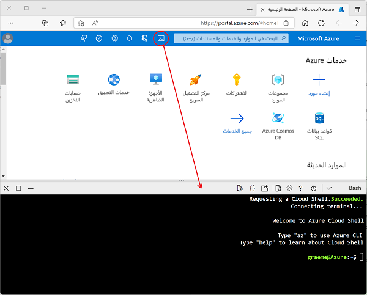

---
lab:
  title: استكشاف Azure Stream Analytics
  module: Explore data analytics in Azure
---

## استكشاف Azure Stream Analytics

في هذا الإجراء، ستقوم بتوفير وظيفة Azure Stream Analytics في اشتراكك في Azure، واستخدامها لمعالجة دفق من البيانات في الوقت الفعلي.

> <bpt id="p1">**</bpt>Note<ept id="p1">**</ept>: The exercise is part of a module on Microsoft Learn, and includes an option to use a <bpt id="p2">*</bpt>sandbox<ept id="p2">*</ept> Azure subscription. However, if you are completing this exercise as part of an instructor-led class, you should use the Azure subscription provided as part of the class instead of the sandbox.

قبل بدء التمرين على Microsoft Learn، ستحتاج إلى إعداد بيئة سحابية shell لاشتراكك في Azure.

1. سجل الدخول إلى اشتراكك في Azure في [مدخل Microsoft Azure](https://portal.azure.com) على `https://portal.azure.com`، باستخدام بيانات اعتماد اشتراك Azure.
2. Use the <bpt id="p1">**</bpt>[<ph id="ph1">\&gt;</ph>_]<ept id="p1">**</ept> button to the right of the search bar at the top of the page to create a new Cloud Shell in the Azure portal, selecting a <bpt id="p2">***</bpt>Bash<ept id="p2">***</ept> environment and creating storage if prompted. The cloud shell provides a command line interface in a pane at the bottom of the Azure portal, as shown here:

    

3. Note that you can resize the cloud shell by dragging the separator bar at the top of the pane, or by using the <bpt id="p1">**</bpt>&amp;#8212;<ept id="p1">**</ept>, <bpt id="p2">**</bpt>&amp;#9723;<ept id="p2">**</ept>, and <bpt id="p3">**</bpt>X<ept id="p3">**</ept> icons at the top right of the pane to minimize, maximize, and close the pane. For more information about using the Azure Cloud Shell, see the <bpt id="p1">[</bpt>Azure Cloud Shell documentation<ept id="p1">](https://docs.microsoft.com/azure/cloud-shell/overview)</ept>.

4. أنت الآن جاهز لإكمال التمرين على Microsoft Learn - ما عليك سوى الاعتياد على استخدام shell السحابي في مدخل Microsoft Azure بدلًا من العبارة (الفارغة) في الوحدة النمطية Learn (التي يتم توفيرها للمتعلمين الذاتيين باستخدام اشتراك وضع الحماية).

    استخدم الارتباط أدناه لفتح التمرين على Microsoft Learn.

    **[انتقل إلى Microsoft Learn](https://docs.microsoft.com/learn/modules/explore-fundamentals-stream-processing/5-exercise-stream-analytics#create-azure-resources)**

> **معلومات إضافية**: إذا كان لديك وقت لاحق، ففكر في العودة إلى وحدة Microsoft Learn النمطية هذه وتجربة التمارين الأخرى التي تحتوي عليها، والتي تتضمن استكشاف Spark Streaming و Azure Synapse Data Explorer.
