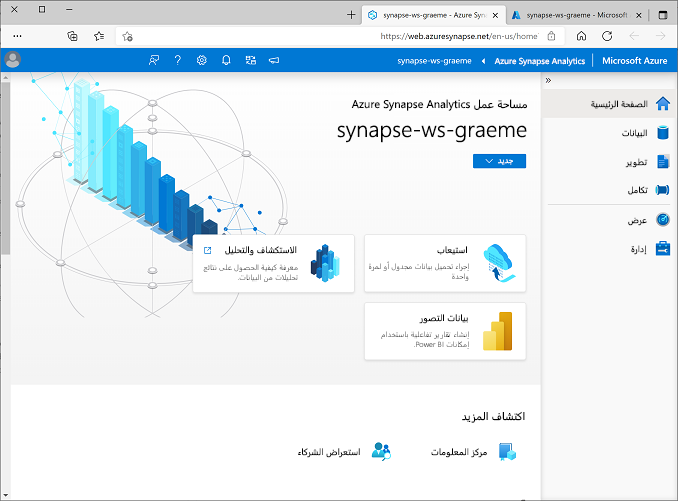

---
lab:
  title: استكشاف Spark Streaming في Azure Synapse Analytics
  module: Explore fundamentals of real-time analytics
---

# استكشاف Spark Streaming في Azure Synapse Analytics

في هذا التمرين، ستستخدم *Spark Structured Streaming* و*جداول دلتا* في Azure Synapse Analytics لمعالجة بيانات الدفق.

سيستغرق إكمال هذا التمرين المعملي **15** دقيقة.

## قبل أن تبدأ

ستحتاج إلى [اشتراك Azure](https://azure.microsoft.com/free) حيث تمتلك وصول على المستوى الإداري.

## توفير مساحة عمل Synapse Analytics

لاستخدام Synapse Analytics، يجب توفير مورد مساحة عمل Synapse Analytics في اشتراك Azure.

1. افتح مدخل Azure على [مدخل Azure](https://portal.azure.com?azure-portal=true)، وقم بتسجيل الدخول باستخدام بيانات الاعتماد المقترنة باشتراك Azure الخاص بك.

    > **ملاحظة**: تأكد من أنك تعمل في الدليل الذي يحتوي على اشتراكك - المُشار إليه في أعلى اليمين أسفل معرف المستخدم. إذا لم تكن كذلك، حدد رمز المستخدم وبدّل الدليل.

2. في مدخل Microsoft Azure، في صفحة **"Home"**، استخدم **&#65291; إنشاء رمز مورد** لإنشاء مورد جديد.
3. ابحث عن *Azure Synapse Analytics*، وإنشاء مورد **Azure Synapse Analytics** جديد باستخدام الإعدادات التالية:
    - **Subscription**: *اشتراكك في Azure*
        - **Resource group**: *إنشاء مجموعة موارد جديدة ذات اسم فريد مثل "synapse-rg"*
        - **مجموعة الموارد المُدارة**: *أدخل اسماً مناسباً، على سبيل المثال "synapse-managed-rg"*.
    - **اسم مساحة العمل**: *أدخل اسم مساحة عمل فريدة، على سبيل المثال "synapse-ws-<your_name>*.
    - **المنطقة**: *اختر أي منطقة متوفرة*.
    - **حدد "Data Lake Storage Gen 2"**: من الاشتراك
        - **اسم الحساب**: *إنشاء حساب جديد باسم فريد، على سبيل المثال "<your_name> datalake"*.
        - **اسم نظام الملفات**: *إنشاء نظام ملفات جديد باسم فريد، على سبيل المثال "fs<your_name>"*.

    > **ملاحظة**: تتطلب مساحة عمل Synapse Analytics مجموعتين من الموارد في اشتراك Azure، مجموعة للموارد التي تُنشئها صراحةً وأخرى للموارد المُدارة التي تستخدمها الخدمة. كما يتطلب حساب تخزين مستودع بيانات لتخزين البيانات والبرامج النصية والبيانات الاصطناعية الأخرى.

4. عند إدخال هذه التفاصيل، حدد **"Review + create"**، ثم حدد **"Create"** لإنشاء مساحة العمل.
5. انتظر حتى يتم إنشاء مساحة العمل - قد يستغرق ذلك خمس دقائق أو نحو ذلك.
6. عند اكتمال التوزيع انتقل إلى مجموعة الموارد التي تم إنشاؤها ولاحظ أنه يحتوي على مساحة عمل Synapse Analytics وحساب تخزين مستودع البيانات.
7. حدد مساحة عمل Synapse، وفي صفحة **"Overview"** الخاصة بها، في بطاقة **"Open Synapse Studio"**، حدد **"Open"** لفتح Synapse Studio في علامة تبويب متصفح جديدة. Synapse Studio هي واجهة قائمة على الويب يمكنك استخدامها للعمل مع مساحة عمل Synapse Analytics.
8. على الجانب الأيسر من Synapse Studio، استخدم الرمز **&rsaquo;&rsaquo;** لتوسيع القائمة - وهذا يكشف عن الصفحات المختلفة داخل Synapse Studio التي ستستخدمها لإدارة الموارد وتنفيذ مهام تحليل البيانات، كما هو موضح هنا:

    

## إنشاء تجمع Spark

لاستخدام Spark لمعالجة بيانات الدفق، تحتاج إلى إضافة تجمع Spark إلى مساحة عمل Azure Synapse.

1. في استوديو Synapse، حدد صفحة **"Manage"**.
2. حدد علامة التبويب **"Apache Spark pools"** ثم استخدم رمز **&#65291، جديد** لإنشاء تجمّع Spark جديد بالإعدادات التالية:
    - **اسم تجمع Apache Spark**: sparkpool
    - **حجم عقدة المجموعة**: الذاكرة محسنة
    - **حجم العقدة**: صغير (4 vCores / 32 GB)
    - **تحجيم تلقائي**: ُممكّن
    - **عدد العقد** 3----3
3. راجع وأنشئ تجمع Spark ثم انتظر حتى يتم نشره (الأمر الذي قد يستغرق بضع دقائق).

## استكشاف معالجة الدفق

لاستكشاف معالجة الدفق باستخدام Spark، ستستخدم دفتر ملاحظات يحتوي على تعليمات برمجية وملاحظات Python لمساعدتك في تنفيذ بعض معالجات الدفق الأساسية باستخدام جداول دلتا وSpark Structured Streaming.

1. قم بتنزيل دفتر ملاحظات [Structured Streaming and Delta Tables.ipynb](https://github.com/MicrosoftLearning/DP-900T00A-Azure-Data-Fundamentals/raw/master/streaming/Spark%20Structured%20Streaming%20and%20Delta%20Tables.ipynb) على الكمبيوتر المحلي (إذا تم فتح دفتر الملاحظات كملف نصي في المستعرض، فاحفظه في مجلد محلي؛ مع الحرص على حفظه كـ **Structured Streaming and Delta Tables.ipynb**، وليس كملف ‎.txt)
2. في استوديو Synapse، حدد صفحة **Manage**.
3. في القائمة **&#65291;**، حدد **&#8612; Import**، وحدد ملف **Structured Streaming and Delta Tables.ipynb** على الكمبيوتر المحلي.
4. اتبع الإرشادات الموجودة في دفتر الملاحظات لإرفاقها بتجمع Spark وتشغيل خلايا التعليمات البرمجية التي تحتوي عليها لاستكشاف طرق مختلفة لاستخدام Spark لمعالجة الدفق.

## قم بحذف موارد Azure.

> **ملاحظة**: يمكنك تخطي هذا القسم إذا كنت تنوي إكمال تمارين أخرى تستخدم Azure Synapse Analytics. وإلا، اتبع الخطوات أدناه لتجنب تكاليف Azure غير الضرورية.

1. أغلق علامة تبويب مستعرض Synapse Studio دون حفظ أية تغييرات، ثم عد إلى مدخل Azure.
1. في مدخل Microsoft Azure، في الصفحة ⁧**الرئيسية**⁩، حدّد ⁧ **"Resource groups"⁦⁩⁧**⁩.
1. حدد مجموعة الموارد لمساحة عمل Synapse Analytics (وليس مجموعة الموارد المُدارة)، وتحقق من أنها تحتوي على مساحة عمل Synapse وحساب التخزين وتجمّع Data Explorer لمساحة العمل الخاصة بك (إذا أكملت التمرين السابق، فستحتوي أيضاً على تجمّع Spark).
1. في أعلى صفحة **"Overview"** لمجموعة الموارد، حدد **"Delete resource group"**.
1. أدخل اسم مجموعة الموارد لتأكيد رغبتك في حذفه، ثم حدد **"Delete"**.

    بعد بضع دقائق، سيتم حذف مساحة عمل Azure Synapse ومساحة العمل المُدارة المقترنة بها.
