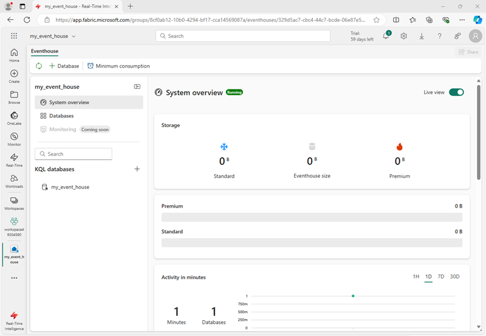
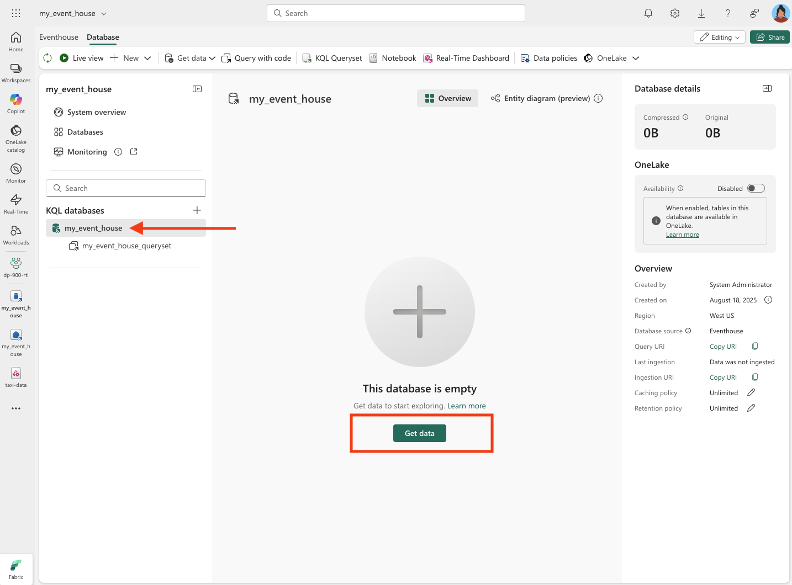

---
lab:
  title: استكشاف التحليلات في الوقت الحقيقي في Microsoft Fabric
  module: Explore real-time analytics in Microsoft Fabric
---

# استكشاف التحليلات في الوقت الحقيقي في Microsoft Fabric

يوفر Microsoft Fabric التحليل الذكي في الوقت الحقيقي، ما يتيح لك إنشاء حلول تحليلية لتدفقات البيانات في الوقت الحقيقي. في هذا التمرين، ستستخدم قدرات التحليل الذكي في الوقت الحقيقي في Microsoft Fabric لاستيعاب وتحليل وتصور دفق البيانات في الوقت الحقيقي من شركة سيارات الأجرة.

يستغرق هذا التمرين المعملي حوالي **30** دقيقة لإكماله.

> **ملاحظة**: تحتاج إلى مستأجر [](https://learn.microsoft.com/fabric/get-started/fabric-trial) Microsoft Fabric لإكمال هذا التمرين.

## إنشاء مساحة عمل

قبل العمل مع البيانات في Fabric، تحتاج إلى إنشاء مساحة عمل مع تمكين سعة Fabric.

> _**تلميح**: مساحة العمل هي الحاوية لكل شيء تقوم بإنشائه (تدفقات الأحداث، ومراكز الأحداث، ولوحات المعلومات). تتيح سعة النسيج تشغيل هذه العناصر._

1. انتقل إلى الصفحة[ الرئيسية ل ](https://app.fabric.microsoft.com/home?experience=fabric)Microsoft Fabric في `https://app.fabric.microsoft.com/home?experience=fabric` مستعرض، وسجل الدخول باستخدام بيانات اعتماد Fabric.

1. في شريط القوائم على اليسار، حدد **مساحات العمل** (تبدو الأيقونة مشابهة لـ ).

1. إنشاء مساحة عمل جديدة باسم من اختيارك، وتحديد وضع ترخيص يتضمن سعة Fabric (*الإصدار التجريبي* أو *Premium* أو *Fabric*).

    > _**تلميح**: يضمن استخدام سعة تتضمن Fabric أن مساحة العمل تحتوي على المحركات اللازمة للابتلاع والتحليلات في الوقت الحقيقي. تحافظ مساحة العمل المنفصلة على موارد المختبر معزولة وسهلة التنظيف._

1. عند فتح مساحة العمل الجديدة، يجب أن تكون فارغة.

    

## إنشاء تدفق أحداث

أنت الآن جاهز للعثور على البيانات في الوقت الحقيقي واستيعابها من مصدر دفق. للقيام بذلك، ستبدأ في Fabric Real-Time Hub.

> _**تلميح**: مركز الوقت الحقيقي مركزية مصادر البث ويجعل من السهل توصيلها. غرز تدفق الأحداث مصادر إلى الوجهات ويمكن أن تضيف تحويلات بينهما._

> **تلميح**: في المرة الأولى التي تستخدم فيها مركز الوقت الحقيقي، قد يتم عرض بعض *تلميحات بدء الاستخدام* . يمكنك إغلاق هذه.

1. في شريط القوائم على اليسار، حدد **مركز الوقت** الحقيقي.

    يوفر المركز في الوقت الحقيقي طريقة سهلة للعثور على مصادر البيانات المتدفقة وإدارتها.

    

1. في لوحة الوصل في الوقت الحقيقي، في **قسم الاتصال ب** ، حدد **مصادر** البيانات.

1. ابحث عن **مصدر بيانات نموذج سيارة أجرة** صفراء وحدد **Connect**. ثم في **معالج الاتصال** ، قم بتسمية المصدر `taxi` وتحرير اسم eventstream الافتراضي لتغييره إلى `taxi-data`. سيسمى الدفق الافتراضي المقترن بهذه البيانات تلقائيا باسم *taxi-data-stream*:

    > _**تلميح**: عينة سيارة الأجرة الصفراء عبارة عن دفق آمن وعام - لا توجد بيانات اعتماد مطلوبة - وهي متسقة لجميع المتعلمين. تسهل الأسماء الواضحة العثور على المصدر و eventstream والتدفق لاحقا._

    

1. حدد **Next** وانتظر حتى يتم إنشاء المصدر و eventstream، ثم حدد **Open eventstream**. سيعرض eventstream مصدر سيارة الأجرة **** **وتيار** بيانات سيارة الأجرة على لوحة التصميم:

   

## إنشاء مركز أحداث

ي استيعاب eventstream لبيانات سيارات الأجرة في الوقت الحقيقي، ولكنه لا يفعل أي شيء معها حاليا. دعونا ننشئ مركز أحداث حيث يمكننا تخزين البيانات الملتقطة في جدول.

> _**تلميح**: تمنحك eventhouse مساحة تخزين دائمة وقاعدة بيانات KQL حتى تتمكن من الاستمرار في الدفق والاستعلام عنه لاحقا - حتى مع وصول أحداث جديدة. KQL (لغة استعلام Kusto) هي لغة للقراءة فقط تشبه SQL تستخدم لاستكشاف مجموعات البيانات الكبيرة وتصفيتها وتحليلها بسرعة_

1. في شريط القوائم على اليسار، حدد **Create**. في *صفحة New* ، ضمن *قسم Real-Time Intelligence* ، حدد **Eventhouse**. أعطه اسما فريدا من اختيارك.

    >**ملاحظة**: إذا **لم يكن الخيار إنشاء** مثبتا على الشريط الجانبي، فستحتاج إلى تحديد خيار علامة الحذف (**...**) أولا.

    

    أغلق أي تلميحات أو مطالبات يتم عرضها حتى ترى eventhouse الجديدة الفارغة.

    

1. في الجزء على اليسار، لاحظ أن eventhouse يحتوي على قاعدة بيانات KQL بنفس اسم eventhouse. يمكنك إنشاء جداول لبياناتك في الوقت الحقيقي في قاعدة البيانات هذه، أو إنشاء قواعد بيانات إضافية حسب الضرورة.

1. حدد قاعدة البيانات، ولاحظ أن هناك مجموعة* استعلام مقترنة*. يحتوي هذا الملف على بعض نماذج استعلامات KQL التي يمكنك استخدامها لبدء الاستعلام عن الجداول في قاعدة البيانات الخاصة بك.

    > _**تلميح**: تحتوي قاعدة بيانات KQL على الجداول الخاصة بك. مجموعة الاستعلامات هي مكان مفيد لكتابة الاستعلامات وتشغيلها دون إعداد إضافي._

    ومع ذلك، لا توجد حاليا جداول للاستعلام. دعونا نحل هذه المشكلة عن طريق الحصول على البيانات من eventstream إلى جدول جديد.

1. في الصفحة الرئيسية لقاعدة بيانات KQL، حدد **Get data**.

    

1. بالنسبة لمصدر البيانات، حدد **Eventstream** > **Existing eventstream**.

1. في **جزء تحديد جدول** وجهة أو إنشائه، أنشئ جدولا جديدا باسم `taxi`. ثم في **جزء تكوين مصدر** البيانات، حدد مساحة العمل الخاصة بك و **eventstream بيانات** سيارة الأجرة وقم بتسمية الاتصال `taxi-table`.

   

1. **استخدم الزر التالي** لإكمال الخطوات لفحص البيانات ثم **إنهاء** التكوين. ثم أغلق نافذة التكوين لمشاهدة Eventhouse الخاص بك مع جدول سيارات الأجرة.

   

    تم إنشاء الاتصال بين الدفق والجدول. لنتحقق من ذلك في eventstream.

1. في شريط القوائم على اليسار، حدد **مركز الوقت** الحقيقي ثم اعرض **صفحة تدفقات** البيانات الخاصة بي. في القائمة ...** لدفق** **تدفق بيانات سيارة الأجرة، حدد **Open eventstream**.**

    يعرض eventstream الآن وجهة للتدفق:

   

    > _**تلميح**: حدد الوجهة على لوحة التصميم، وإذا لم يتم عرض أي معاينة للبيانات أسفلها، فحدد **تحديث**._

    > _**تلميح**: التحقق في eventstream يؤكد أن الأحداث تتدفق إلى الوجهة. قد تخزن المعاينة مؤقتا — يسحب التحديث أحدث عينة._

    في هذا التمرين، قمت بإنشاء eventstream بسيط جدا يلتقط البيانات في الوقت الحقيقي ويحملها في جدول. في حل حقيقي، عادة ما تضيف تحويلات لتجميع البيانات عبر النوافذ الزمنية (على سبيل المثال، لتسجيل متوسط سعر كل سهم على مدى خمس دقائق).

    الآن دعونا نستكشف كيف يمكنك الاستعلام عن البيانات الملتقطة وتحليلها.

## الاستعلام عن البيانات الملتقطة

يلتقط eventstream بيانات أجرة سيارات الأجرة في الوقت الحقيقي ويحملها في جدول في قاعدة بيانات KQL. يمكنك الاستعلام عن هذا الجدول لمشاهدة البيانات الملتقطة.

> _**تلميح**: تم تصميم KQL لاستكشاف سريع للبيانات ذات الطابع الزمني وعالي الحجم. يتيح لك الاستعلام التحقق من صحة الاستيعاب وبدء التحليل على الفور._

1. في شريط القوائم على اليسار، حدد قاعدة بيانات eventhouse.

1. *حدد مجموعة* الاستعلام لقاعدة البيانات الخاصة بك.

1. في جزء الاستعلام، قم بتعديل استعلام المثال الأول كما هو موضح هنا:

    ```kql
    taxi
    | take 100
    ```

    > _**تلميح**: `take 100` هو فحص سريع لصحة — تأكد من وصول الصفوف وفحص عينة صغيرة دون مسح كل شيء ضوئيا._

1. حدد رمز الاستعلام وقم بتشغيله لمشاهدة 100 صف من البيانات من الجدول.

    

1. راجع النتائج، ثم قم بتعديل الاستعلام لإظهار عدد سيارات الأجرة لكل ساعة:

    ```kql
    taxi
    | summarize PickupCount = count() by bin(todatetime(tpep_pickup_datetime), 1h)
    ```

1. قم بتمييز الاستعلام المعدل وتشغيله لمشاهدة النتائج.

    > _**تلميح**: `bin(..., 1h)` تجميع الأحداث في مستودعات كل ساعة، ما يجعل من السهل اكتشاف الاتجاهات بمرور الوقت._

1. انتظر بضع ثوان ثم قم بتشغيله مرة أخرى، مع ملاحظة أن عدد عمليات الاستلام يتغير مع إضافة بيانات جديدة إلى الجدول من الدفق في الوقت الفعلي.

    > _**تلميح**: يستمر الدفق في إضافة البيانات، لذلك تتغير النتائج بمرور الوقت. تظهر إعادة التشغيل كيفية تحديث التجميعات مع وصول أحداث جديدة._

## تنظيف الموارد

في هذا التمرين، قمت بإنشاء مركز أحداث، واستيعاب البيانات في الوقت الحقيقي باستخدام eventstream، والاستعلام عن البيانات التي تم استيعابها في جدول قاعدة بيانات KQL، وإنشاء لوحة معلومات في الوقت الحقيقي لتصور البيانات في الوقت الفعلي، وتكوين تنبيه باستخدام المنشط.

إذا انتهيت من استكشاف التحليل الذكي في الوقت الحقيقي في Fabric، يمكنك حذف مساحة العمل التي أنشأتها لهذا التمرين.

> _**تلميح**: يؤدي حذف مساحة العمل إلى إزالة جميع العناصر التي تم إنشاؤها في المختبر ويساعد على منع الرسوم المستمرة._

1. في الشريط على اليسار، حدد أيقونة مساحة العمل الخاصة بك.

1. في شريط الأدوات، حدد **إعدادات** مساحة العمل.

1. في **القسم عام** ، حدد **إزالة مساحة** العمل هذه.
