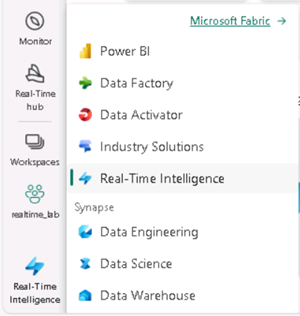

---
lab:
  title: استكشاف التحليلات في الوقت الحقيقي في Microsoft Fabric
  module: Explore fundamentals of large-scale data analytics
---

# استكشاف التحليلات في الوقت الحقيقي في Microsoft Fabric

في هذا التمرين، ستستكشف التحليلات في الوقت الحقيقي في Microsoft Fabric.

سيستغرق إكمال هذا التمرين المعملي **25** دقيقة.

> **ملاحظة**: ستحتاج إلى ترخيص Microsoft Fabric لإكمال هذا التمرين. راجع [بدء استخدام Fabric](https://learn.microsoft.com/fabric/get-started/fabric-trial) للحصول على تفاصيل حول كيفية تمكين ترخيص تجريبي مجاني ل Fabric. ستحتاج إلى حساب عمل* أو *مدرسة* Microsoft *للقيام بذلك. إذا لم يكن لديك حساب، فيمكنك [التسجيل للحصول على إصدار تجريبي من Microsoft Office 365 E3 أو إصدار أحدث](https://www.microsoft.com/microsoft-365/business/compare-more-office-365-for-business-plans).

## إنشاء مساحة عمل

قبل العمل مع البيانات في Fabric، قم بإنشاء مساحة عمل مع تمكين الإصدار التجريبي Fabric.

1. سجل الدخول إلى [Microsoft Fabric](https://app.fabric.microsoft.com) على `https://app.fabric.microsoft.com`.
2. في شريط القوائم على اليسار، حدد **مساحات** العمل (تبدو الأيقونة مشابهة ل &128455;).
3. أنشئ مساحة عمل جديدة باسم من اختيارك، مع تحديد وضع ترخيص في **قسم Advanced** يتضمن سعة Fabric (*الإصدار التجريبي* أو *Premium* أو *Fabric*).
4. عند فتح مساحة العمل الجديدة، يجب أن تكون فارغة.

    

## إنشاء مصدر بيانات جديد

الآن بعد أن أصبح لديك مساحة عمل، يمكنك إنشاء قاعدة بيانات KQL لتخزين البيانات في الوقت الحقيقي.

1. في الجزء السفلي الأيسر من المدخل، قم بالتبديل إلى **تجربة تحليلات** الوقت الحقيقي.

    

    تتضمن الصفحة الرئيسية لتحليلات الوقت الحقيقي لوحات لإنشاء أصول شائعة الاستخدام ل analyis للبيانات في الوقت الحقيقي

2. في الصفحة الرئيسية لتحليلات الوقت الحقيقي، أنشئ قاعدة بيانات** KQL جديدة **باسم من اختيارك.

    بعد دقيقة أو نحو ذلك، سيتم إنشاء قاعدة بيانات KQL جديدة:

    

    حاليا، لا توجد جداول في قاعدة البيانات.

## إنشاء eventstream

توفر تدفقات الأحداث طريقة قابلة للتطوير ومرنة لاستيعاب البيانات في الوقت الحقيقي من مصدر دفق.

1. في شريط القوائم على اليسار، حدد **الصفحة الرئيسية** لتجربة التحليلات في الوقت الحقيقي.
1. في الصفحة الرئيسية، حدد اللوحة لإنشاء Eventstream** جديد **باسم من اختيارك.

    بعد وقت قصير، يتم عرض المصمم المرئي ل eventstream الخاص بك.

    

    تعرض لوحة المصمم المرئي مصدرا يتصل ب eventstream الخاص بك، والذي بدوره متصل بوجهة.

1. في لوحة المصمم، في **القائمة New source** لمصدرك، حدد **Sample data**. ثم في **جزء بيانات** العينة، حدد اسم **سيارات الأجرة** وحدد **بيانات عينة سيارة الأجرة** الصفراء (التي تمثل البيانات التي تم جمعها من رحلات سيارات الأجرة). بعد ذلك، حدد **إضافة**.
1. أسفل لوحة المصمم، حدد **علامة التبويب Data preview** لمعاينة البيانات التي يتم دفقها من المصدر:

    

1. على لوحة المصمم، في قائمة الوجهة **** الجديدة لوجهتك، حدد **قاعدة بيانات** KQL. ثم في **جزء قاعدة بيانات** KQL، حدد اسم **الوجهة taxi-data** وحدد مساحة العمل وقاعدة بيانات KQL. ثم حدد **إنشاء وتكوين**.
1. في **معالج استيعاب البيانات**، في صفحة الوجهة****، حدد **جدول** جديد وأدخل اسم **الجدول taxi-data**. حدد **Next: Source**.
1. في **صفحة المصدر** ، راجع اسم اتصال البيانات الافتراضي، ثم حدد **التالي: المخطط**.
1. في **صفحة المخطط** ، قم بتغيير **تنسيق** البيانات من TXT إلى **JSON**، واعرض المعاينة للتحقق من أن هذا التنسيق ينتج عنه أعمدة متعددة من البيانات. حدد **"Next: Summary"**.
1. في **صفحة الملخص** ، انتظر حتى يتم إنشاء الاستيعاب المستمر، ثم حدد **إغلاق**.
1. تحقق من أن eventstream المكتمل يبدو كما يلي:

    

## الاستعلام عن البيانات في الوقت الحقيقي في قاعدة بيانات KQL

يقوم eventstream الخاص بك بملء جدول باستمرار في قاعدة بيانات KQL الخاصة بك، ما يتيح لك الاستعلام عن البيانات في الوقت الفعلي.

1. في مركز القائمة على اليسار، حدد قاعدة بيانات KQL (أو حدد مساحة العمل وابحث عن قاعدة بيانات KQL هناك).
1. في **القائمة ...** لجدول **بيانات** سيارة الأجرة (الذي تم إنشاؤه بواسطة eventstream)، حدد **جدول الاستعلام > السجلات التي تم تناولها في آخر 24 ساعة**.

    

1. عرض نتائج الاستعلام، والتي يجب أن تكون استعلام KQL كما يلي:

    ```kql
    ['taxi-data']
    | where ingestion_time() between (now(-1d) .. now())
    ```

    تظهر النتائج جميع سجلات سيارات الأجرة التي تم تناولها من مصدر الدفق في آخر 24 ساعة.

1. استبدل كافة التعليمات البرمجية لاستعلام KQL في النصف العلوي من محرر الاستعلام بالتعليمات البرمجية التالية:

    ```kql
    // This query returns the number of taxi pickups per hour
    ['taxi-data']
    | summarize PickupCount = count() by bin(tpep_pickup_datetime, 1h)
    ```

1. **استخدام &9655; قم بتشغيل** الزر لتشغيل الاستعلام ومراجعة النتائج، والتي تظهر عدد سيارات الأجرة لكل ساعة.

## تنظيف الموارد

إذا انتهيت من استكشاف التحليلات في الوقت الحقيقي في Microsoft Fabric، يمكنك حذف مساحة العمل التي أنشأتها لهذا التمرين.

1. في الشريط على اليسار، حدد أيقونة مساحة العمل لعرض جميع العناصر التي تحتوي عليها.
2. في **القائمة ...** على شريط الأدوات، حدد **Workspace settings**.
3. في **المقطع غير ذلك** ، حدد **إزالة مساحة** العمل هذه.
