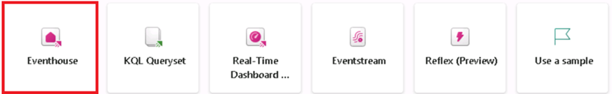
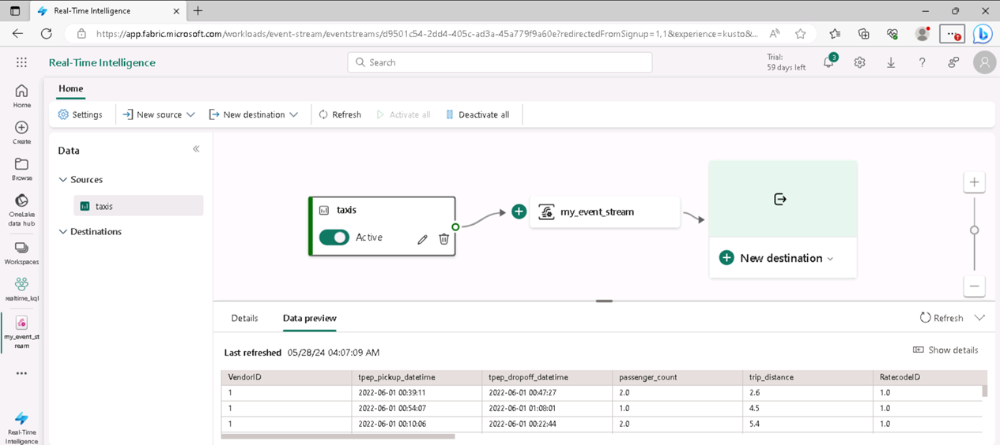

---
lab:
  title: استكشاف التحليلات في الوقت الحقيقي في Microsoft Fabric
  module: Explore fundamentals of large-scale data analytics
---

# استكشاف التحليلات في الوقت الحقيقي في Microsoft Fabric

في هذا التمرين، ستستكشف التحليلات في الوقت الحقيقي في Microsoft Fabric.

سيستغرق إكمال هذا التمرين المعملي **25** دقيقة.

> **ملاحظة**: ستحتاج إلى ترخيص Microsoft Fabric لإكمال هذا التمرين. راجع [بدء استخدام Fabric](https://learn.microsoft.com/fabric/get-started/fabric-trial) للحصول على تفاصيل حول كيفية تمكين ترخيص تجريبي مجاني لـ Fabric. ستحتاج إلى حساب Microsoft الخاص بـ *المؤسسة التعليمية* أو *العمل* للقيام بذلك. إذا لم يكن لديك حساب، فيمكنك [التسجيل للحصول على إصدار تجريبي من Microsoft Office 365 E3 أو إصدار أحدث](https://www.microsoft.com/microsoft-365/business/compare-more-office-365-for-business-plans).

## إنشاء مساحة عمل

قبل العمل مع البيانات في Fabric، قُم بإنشاء مساحة عمل مع تمكين الإصدار التجريبي لـ Fabric.

1. سجل الدخول إلى [Microsoft Fabric](https://app.fabric.microsoft.com) على `https://app.fabric.microsoft.com`.
2. في شريط القوائم على اليسار، حدد **مساحات العمل** (تبدو الأيقونة مشابهة لـ ).
3. أنشئ مساحة عمل جديدة باسم من اختيارك، مع تحديد وضع ترخيص في قسم **المتقدمة** يتضمن سعة Fabric (*الإصدار التجريبي* أو *Premium* أو *Fabric*).
4. عند فتح مساحة العمل الجديدة، يجب أن تكون فارغة.

    

## إنشاء قاعدة بيانات KQL

الآن بعد أن أصبح لديك مساحة عمل، يمكنك إنشاء قاعدة بيانات KQL لتخزين البيانات في الوقت الحقيقي.

1. في الجزء السفلي الأيسر من المدخل، قُم بالتبديل إلى تجربة **تحليلات الوقت الحقيقي**.

    

    تشتمل الصفحة الرئيسية للتحليلات في الوقت الفعلي على لوحات لإنشاء أصول شائعة الاستخدام لتحليل البيانات في الوقت الحقيقي

2. في الصفحة الرئيسية لتحليلات الوقت الحقيقي، قم بإنشاء **قاعدة بيانات KQL** جديدة باسم من اختيارك.

    

   سترى شاشة لوحة المعلومات ثم حدد زر قاعدة بيانات KQL في الأعلى.

    

    بمجرد تحديده، سيتم منحك ***مربع حوار قاعدة بيانات*** KQL جديدة حيث ستمنح قاعدة بيانات KQL اسما.

    

   - قم بتسمية قاعدة البيانات، في هذا السيناريو، وهي: `my_kql_db`
   - انقر فوق، ***إنشاء***
  
    بعد دقيقة أو نحو ذلك، سيتم إنشاء قاعدة بيانات KQL جديدة:

    حاليا، لا توجد جداول في قاعدة البيانات.

## إنشاء تدفق أحداث

توفر تدفقات الأحداث طريقة قابلة للتطوير ومرنة لاستيعاب البيانات في الوقت الحقيقي من مصدر تدفق.

1. في شريط القائمة على اليسار، حدد **الصفحة الرئيسية** لتجربة التحليلات في الوقت الحقيقي.
1. في الصفحة الرئيسية، حدد اللوحة لإنشاء **تدفق أحداث** جديد باسم من اختيارك.

    بعد وقت قصير، يتم عرض المصمم المرئي لتدفق الأحداث الخاص بك.

    

    تعرض لوحة المصمم المرئي مصدرا يتصل بتدفق الأحداث الخاص بك، والذي بدوره متصل بوجهة.

1. في لوحة المصمم، في القائمة **مصدر جديد** لمصدرك، حدد **نموذج البيانات**. ثم في جزء **بيانات العينة**، حدد اسم **سيارات الأجرة** وحدد بيانات عينة **سيارة الأجرة الصفراء** (التي تمثل البيانات التي تم جمعها من رحلات سيارات الأجرة). بعد ذلك، حدد **إضافة**.
1. أسفل لوحة المصمم، حدد علامة التبويب **معاينة البيانات** لمعاينة البيانات التي يتم دفقها من المصدر:

    

1. في لوحة المصمم، في قائمة **الوجهة الجديدة** لوجهتك، حدد **قاعدة بيانات KQL**. ثم في جزء **قاعدة بيانات KQL**، حدد **بيانات سيارة الأجرة** لاسم الوجهة وحدد مساحة العمل وقاعدة بيانات KQL. ثم حدد **إنشاء وتكوين**.
1. في معالج **استيعاب البيانات**، في صفحة **الوجهة**، حدد **جدول جديد** وأدخل اسم الجدول **بيانات سيارة الأجرة**. حدد **االتالي: المصدر**.
1. في صفحة **المصدر** ، راجع اسم اتصال البيانات الافتراضي، ثم حدد **التالي: المخطط**.
1. في صفحة **المخطط** ، قُم بتغيير **تنسيق البيانات** من TXT إلى **JSON**، واعرض المعاينة للتحقق من أن هذا التنسيق ينتج عنه أعمدة متعددة من البيانات. حدد  **التالي: الملخص**.
1. في صفحة **الملخص**، انتظر حتى يتم إنشاء الاستيعاب المستمر، ثم حدد **إغلاق**.
1. تحقق من أن تدفق الأحداث المكتمل يبدو كما يلي:

    

## الاستعلام عن البيانات في الوقت الحقيقي في قاعدة بيانات KQL

يقوم تدفق الأحداث الخاص بك بملء جدول باستمرار في قاعدة بيانات KQL الخاصة بك، ما يتيح لك الاستعلام عن البيانات في الوقت الفعلي.

1. في مركز القائمة على اليسار، حدد قاعدة بيانات KQL (أو حدد مساحة العمل الخاصة بك وابحث عن قاعدة بيانات KQL هناك).
1. في القائمة ** ...** لجدول **بيانات سيارة الأجرة** (الذي تم إنشاؤه بواسطة eventstream)، حدد **جدول الاستعلام > السجلات التي تم استيعابها في آخر 24 ساعة**.

    

1. عرض نتائج الاستعلام، والتي يجب أن تكون استعلام KQL كما يلي:

    ```kql
    ['taxi-data']
    | where ingestion_time() between (now(-1d) .. now())
    ```

    تظهر النتائج جميع سجلات سيارات الأجرة التي تم استيعابها من مصدر الدفق في آخر 24 ساعة.

1. استبدل كافة التعليمات البرمجية لاستعلام KQL في النصف العلوي من محرر الاستعلام بالتعليمات البرمجية التالية:

    ```kql
    // This query returns the number of taxi pickups per hour
    ['taxi-data']
    | summarize PickupCount = count() by bin(todatetime(tpep_pickup_datetime), 1h)
    ```

1. استخدم زر **&#9655; تشغيل** لتشغيل الاستعلام ومراجعة النتائج، والتي تظهر عدد سيارات الأجرة لكل ساعة.

## تنظيف الموارد

إذا انتهيت من استكشاف التحليلات في الوقت الحقيقي في Microsoft Fabric، يمكنك حذف مساحة العمل التي أنشأتها لهذا التمرين.

1. في الشريط على اليسار، حدد أيقونة مساحة العمل لعرض كافة العناصر التي تحتوي عليها.
2. في القائمة **...** على شريط الأدوات، حدد **إعدادات مساحة العمل**.
3. في قسم **الأخرى**، حدد **إزالة مساحة العمل هذه**.
