---
lab:
  title: استكشاف أساسيات تصور البيانات باستخدام Power BI
  module: Explore fundamentals of data visualization
---

# استكشاف أساسيات تصور البيانات باستخدام Power BI

في هذا التمرين، ستستخدم Microsoft Power BI Desktop لإنشاء نموذج بيانات وتقرير يحتوي على مرئيات بيانات تفاعلية.

سيستغرق إكمال هذا التمرين المعملي **20** دقيقة.

## ‏‏تثبيت Power BI Desktop

إذا لم يكن Microsoft Power BI Desktop مثبتاً بالفعل على جهاز الكمبيوتر الذي يعمل بنظام Windows، يمكنك تنزيله وتثبيته مجاناً.

1. تنزيل مثبّت Power BI Desktop من [https://aka.ms/power-bi-desktop](https://aka.ms/power-bi-desktop?azure-portal=true).
1. عند تنزيل الملف، افتحه واستخدم معالج الإعداد لتثبيت Power BI Desktop على جهاز الكمبيوتر. قد يستغرق هذا التثبيت بضع دقائق.

## استيراد البيانات

1. افتح Power BI Desktop. يجب أن تبدو واجهة التطبيق مشابهة لما يلي:

    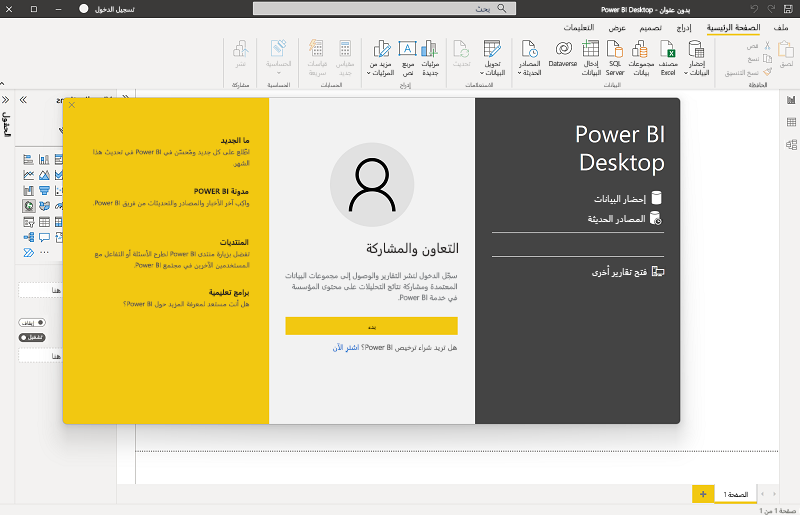

    أنت الآن جاهز لاستيراد البيانات للتقرير الخاص بك.

1. في شاشة الترحيب في Power BI Desktop، حدد **Get data**، ثم في قائمة مصادر البيانات، حدد **Web** ثم حدد **Connect**.

    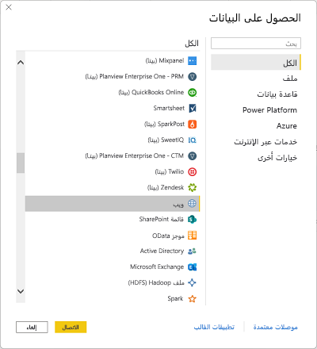

1. في مربع الحوار **From web**، أدخل عنوان URL التالي ثم حدد **OK**:

    ```
    https://github.com/MicrosoftLearning/DP-900T00A-Azure-Data-Fundamentals/raw/master/power-bi/customers.csv
    ```

1. في مربع الحوار "Access Web content"، حدد "**Connect**".

1. تحقق من أن عنوان URL يفتح مجموعة بيانات تحتوي على بيانات العميل، كما هو موضح أدناه. ثم حدد **Load** لتحميل البيانات في نموذج البيانات للتقرير الخاص بك.

    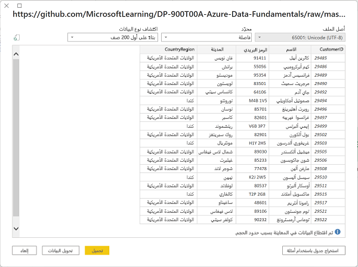

1. في نافذة Power BI Desktop الرئيسية، في قائمة "Data" حدد "**Get data**" ثم حدد "**Web**":

    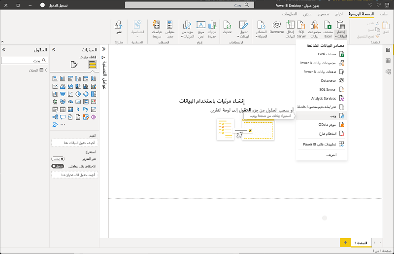

1. في مربع الحوار **From web**، أدخل عنوان URL التالي ثم حدد **OK**:

    ```
    https://github.com/MicrosoftLearning/DP-900T00A-Azure-Data-Fundamentals/raw/master/power-bi/products.csv
    ```

1. في مربع الحوار، حدد "**Load**" لتحميل بيانات المنتج الموجودة بهذا الملف إلى نموذج البيانات.

1. كرر الخطوات الثلاث السابقة لاستيراد مجموعة بيانات ثالثة تحتوي على بيانات الطلب من عنوان URL التالي:

    ```
    https://github.com/MicrosoftLearning/DP-900T00A-Azure-Data-Fundamentals/raw/master/power-bi/orders.csv
    ```

## استكشاف نموذج بيانات

تم تحميل جداول البيانات الثلاثة التي قمت باستيرادها في نموذج بيانات، والذي ستقوم الآن باستكشافه وتحسينه.

1. في Power BI Desktop، في الجزء الأيسر، حدد علامة التبويب "**Model**"، ثم رتب الجداول في النموذج بحيث يمكنك رؤيتها. يمكنك إخفاء الأجزاء على الجانب الأيمن باستخدام الرمز **>>**:

    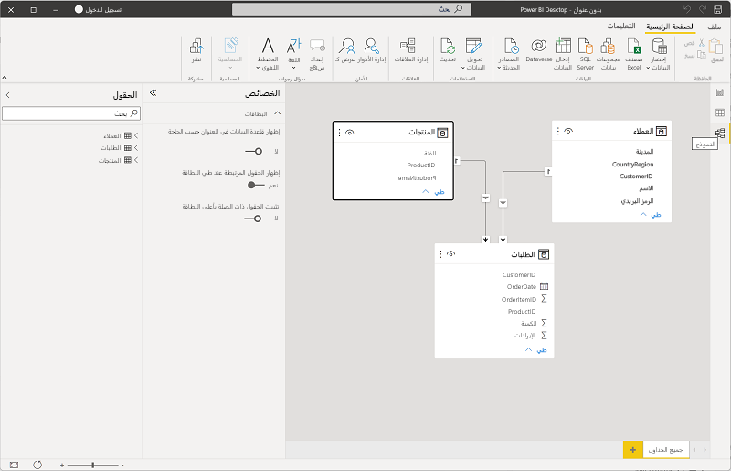

1. في جدول **orders**، حدد حقل **Revenue** ثم في جزء **Properties**، قم بتعيين خاصية **Format** الخاصة به إلى **Currency**:

    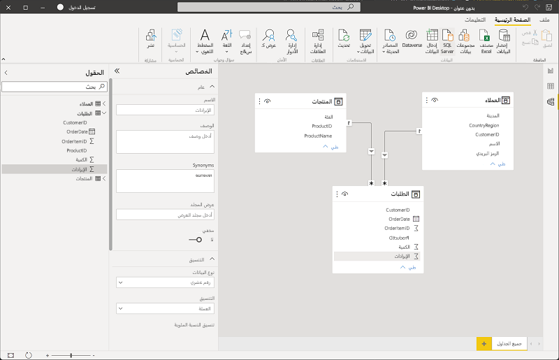

    ستضمن هذه الخطوة عرض قيم الإيرادات كعملة في تصورات التقرير.

1. في جدول "products"، انقر بزر الماوس الأيمن فوق حقل "**Category**" (أو افتح القائمة **&vellip;**) وحدد "**Create hierarchy**". تُنشئ هذه الخطوة تسلسلاً هرمياً يسمى "**Category Hierarchy**". قد تحتاج إلى توسيع جدول "**products**" أو التمرير لأسفل لمشاهدة ذلك - يمكنك أيضاً رؤيته في جزء "**Fields**":

    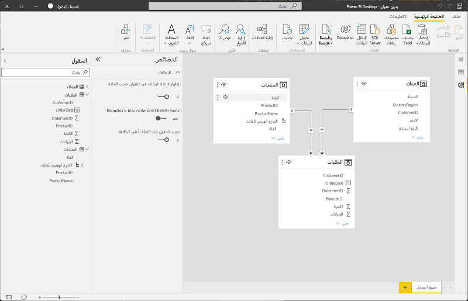

1. في جدول "products"، انقر بزر الماوس الأيمن فوق الحقل "**ProductName**" (أو افتح القائمة **&vellip;**) وحدد "**Add to hierarchy** > **Category Hierarchy**". يؤدي هذا إلى إضافة حقل **ProductName** إلى التسلسل الهرمي الذي قمت بإنشائه مسبقاً.
1. في جزء **Fields**، انقر بزر الماوس الأيمن فوق **Category Hierarchy** (أو افتح القائمة **...**) وحدد **Rename**. ثم أعد تسمية التسلسل الهرمي إلى **Categorized Product**.

    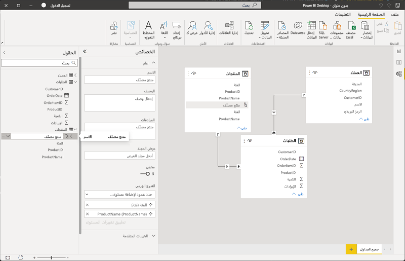

1. على الحافة اليمنى، حدد **علامة التبويب طريقة عرض** الجدول، ثم في **جزء البيانات** ، حدد **جدول العملاء** .
1. حدد رأس العمود **City**، ثم عيّن الخاصية **Data Category** إلى **City**:

    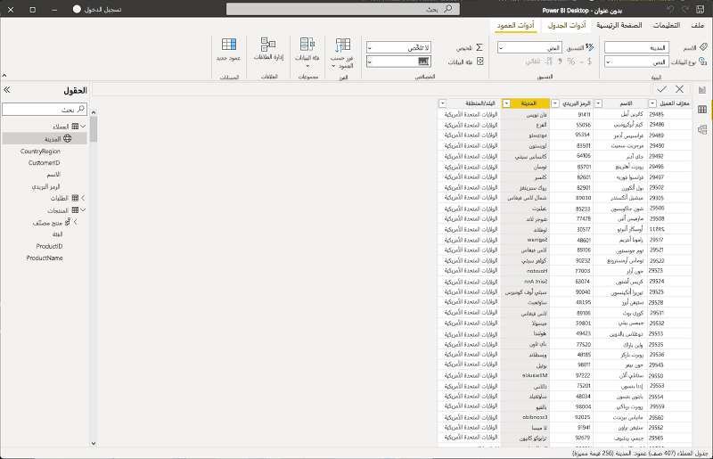

    ستضمن هذه الخطوة تفسير القيم الموجودة في هذا العمود على أنها أسماء مدن، ما قد يكون مفيداً إذا كنت تنوي تضمين تصورات المخطط.

## إنشاء تقرير

أنت الآن جاهز تقريباً لإنشاء تقرير. عليك أولاً التحقق من بعض الإعدادات للتأكد من تمكين جميع التصورات.

1. في القائمة **File**، حدد **Options and Settings**. ثم حدد **Options**، وفي قسم **Security**، تأكد من تمكين ** استخدام تصورات المخطط والمخطط المعبأ ** وحدد **OK**.

    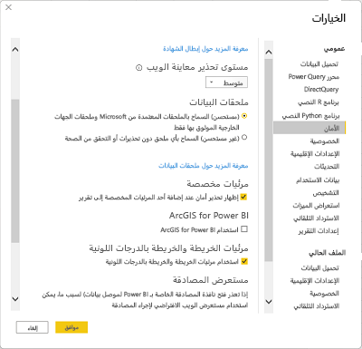

    تضمن هذه الخطوة إمكانية تضمين تصورات المخطط في التقارير.

1. على الحافة اليسرى، حدد علامة التبويب **عرض التقرير** واعرض واجهة تصميم التقرير.

    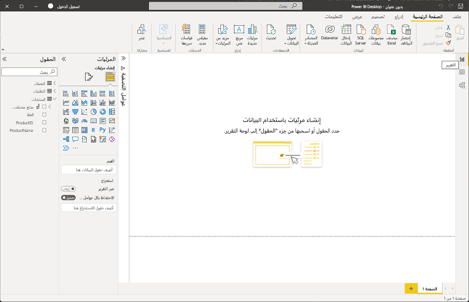

1. في الشريط، أعلى سطح تصميم التقرير، حدد **Text Box** وأضف مربع نص يحتوي على النص **Sales Report** إلى التقرير. قم بتنسيق النص لجعله غامقاً بحجم خط 32.

    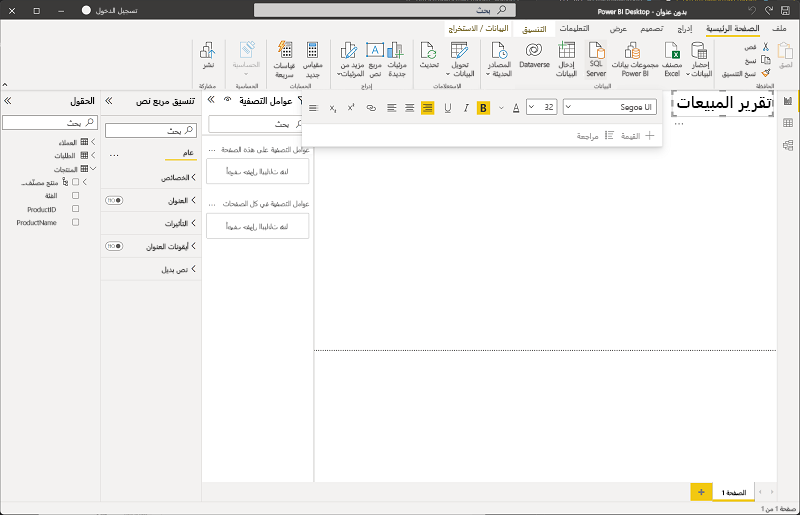

1. حدد أي منطقة فارغة في التقرير لإلغاء تحديد مربع النص. ثم في جزء **البيانات**، قم بتوسيع **المنتجات** وحدد حقل **المنتجات المقسمة لفئات**. تضيف هذه الخطوة جدولاً إلى التقرير.

    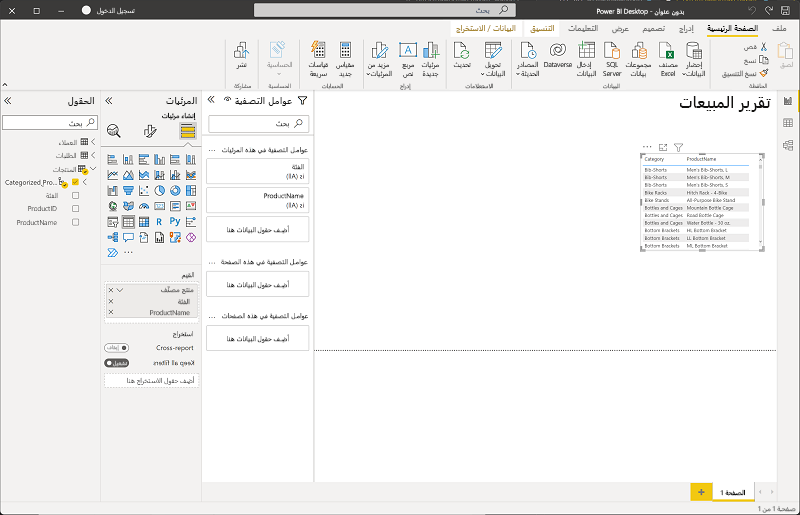

1. مع استمرار تحديد الجدول، في جزء **البيانات** قم بتوسيع **الطلبات** وحدد **الإيرادات**. يُضاف عمود "Revenue" إلى الجدول. قد تحتاج إلى توسيع حجم الجدول لرؤيته.

    الإيرادات منسقة كعملة، كما حددت في النموذج. ومع ذلك، فإنك لم تحدد عدد المنازل العشرية، لذا فإن القيم تتضمن مقادير كسرية. لا يهم التصورات التي ستنشئها، حيث يمكنك الرجوع إلى علامة التبويب "**Model**" أو "**Data**" وتغيير المنازل العشرية إن أردت.

    

1. مع استمرار تحديد الجدول، في جزء **Visualizations**، حدد التصور **المخطط البياني العمودي المكدس**. تم تغيير الجدول إلى مخطط عمودي يعرض الإيرادات حسب الفئة.

    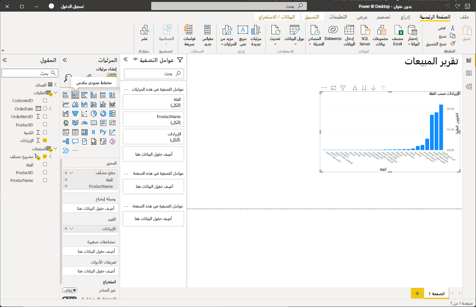

1. فوق المخطط البياني العمودي المحدد، حدد الرمز **&#8595;** لتشغيل التنقل لأسفل. ثم في المخطط البياني، حدد العمود الثاني للتنقل ومعرفة إيرادات المنتجات الفردية في هذه الفئة. هذه الإمكانية ممكنة لأنك حددت تسلسلاً هرمياً للفئات والمنتجات.

    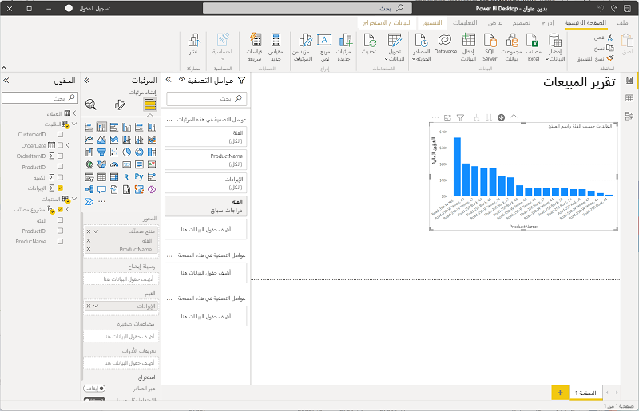

1. استخدم الرمز **&#x2191;** للعودة إلى مستوى الفئة. ثم حدد الرمز **(**&#8595;**)** لإيقاف تشغيل ميزة التنقل لأسفل.
1. حدد منطقة فارغة من التقرير، ثم في جزء **البيانات**، حدد حقل **الكمية** في جدول **الطلبات** و**الفئة** في جدول **المنتجات**. ينتج عن هذه الخطوة مخطط بياني عمودي آخر يوضح حجم المبيعات حسب فئة المنتج.
1. مع تحديد مخطط العمود الجديد، في جزء **Visualizations**، حدد **Pie chart** ثم غيّر حجم المخطط البياني وضعه بجوار المخطط البياني لعمود الإيرادات حسب الفئة.

    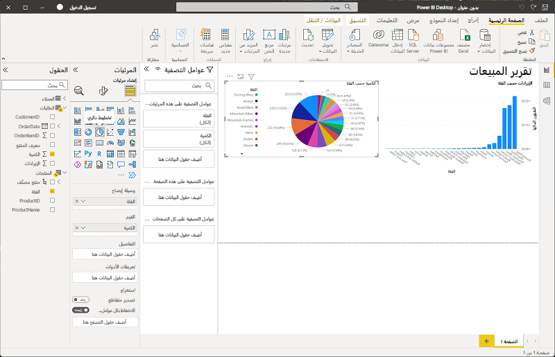

1. حدد منطقة فارغة من التقرير، ثم في جزء **البيانات**، حدد حقل **المدينة** في جدول **العملاء** ثم حدد **الإيرادات** في جدول **الأوامر**. ما ينتج عنه خريطة توضح إيرادات المبيعات حسب المدينة. أعد ترتيب المرئيات وغيّر حجمها حسب الحاجة:

    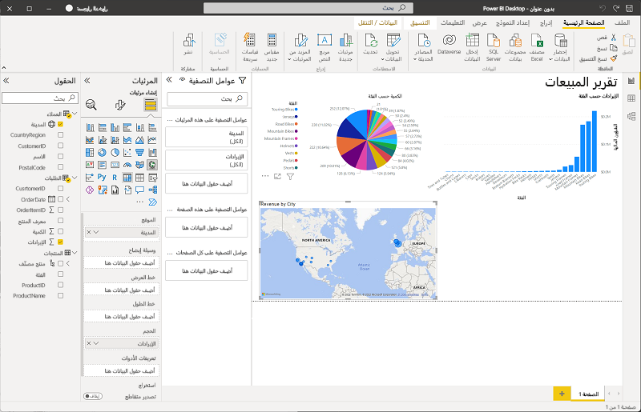

1. في المخطط، لاحظ أنه يمكنك السحب أو النقر المزدوج أو استخدام عجلة الماوس أو الضغط والسحب على شاشة اللمس للتفاعل. ثم حدد مدينة معينة، ولاحظ أنه تم تعديل التصورات الأخرى في التقرير لتمييز البيانات الخاصة بالمدينة المحددة.

    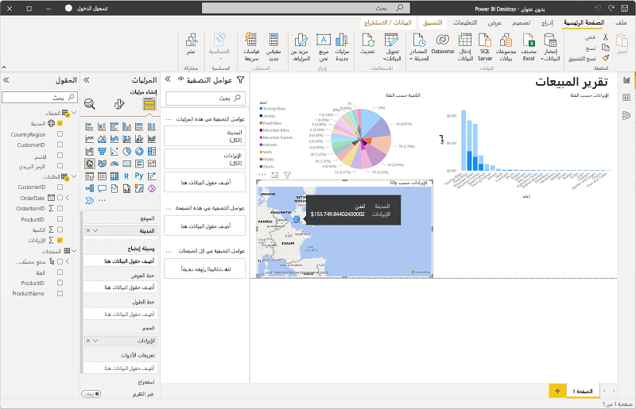

1. في القائمة **ملف**، حدد **حفظ**. ثم احفظ الملف باسم ملف .pbix مناسب. يمكنك فتح الملف واستكشاف نمذجة البيانات والتصور بشكل أكبر في وقت فراغك.

إذا كان لديك اشتراك في [خدمة Power BI](https://www.powerbi.com/?azure-portal=true)، يمكنك تسجيل الدخول إلى حسابك ونشر التقرير إلى مساحة عمل Power BI. 
