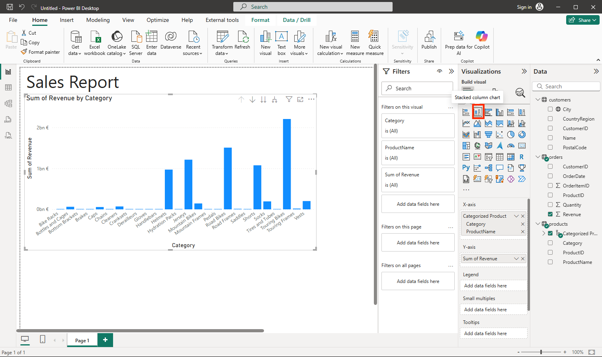

---
lab:
  title: استكشاف أساسيات تصور البيانات باستخدام Power BI
  module: Explore fundamentals of data visualization
---

# <a name="explore-fundamentals-of-data-visualization-with-power-bi"></a>استكشاف أساسيات تصور البيانات باستخدام Power BI

في هذا التمرين، ستستخدم Microsoft Power BI Desktop لإنشاء نموذج بيانات وتقرير يحتوي على مرئيات بيانات تفاعلية.

سيستغرق إكمال هذا التمرين المعملي **20** دقيقة.

## <a name="before-you-start"></a>قبل البدء

ستحتاج إلى [اشتراك Azure](https://azure.microsoft.com/free) حيث تمتلك وصول على المستوى الإداري.

### <a name="install-power-bi-desktop"></a>تثبيت Power BI Desktop

إذا لم يكن Microsoft Power BI Desktop مثبتاً بالفعل على جهاز الكمبيوتر الذي يعمل بنظام Windows، يمكنك تنزيله وتثبيته مجاناً.

1. تنزيل مثبّت Power BI Desktop من [https://aka.ms/power-bi-desktop](https://aka.ms/power-bi-desktop?azure-portal=true).
1. When the file has downloaded, open it, and use the setup wizard to install Power BI Desktop on your computer. This insatllation may take a few minutes.

## <a name="import-data"></a>استيراد البيانات

1. Open Power BI Desktop. The application interface should look similar to this:

    

    أنت الآن جاهز لاستيراد البيانات للتقرير الخاص بك.

1. في شاشة الترحيب في Power BI Desktop، حدد **Get data**، ثم في قائمة مصادر البيانات، حدد **Web** ثم حدد **Connect**.

    

1. في مربع الحوار **From web**، أدخل عنوان URL التالي ثم حدد **OK**:

    ```
    https://github.com/MicrosoftLearning/DP-900T00A-Azure-Data-Fundamentals/raw/master/power-bi/customers.csv
    ```

1. في مربع الحوار "Access Web content"، حدد "**Connect**".

1. Verify that the URL opens a dataset containing customer data, as shown below. Then select <bpt id="p1">**</bpt>Load<ept id="p1">**</ept> to load the data into the data model for your report.

    

1. في نافذة Power BI Desktop الرئيسية، في قائمة "Data" حدد "**Get data**" ثم حدد "**Web**":

    

1. في مربع الحوار **From web**، أدخل عنوان URL التالي ثم حدد **OK**:

    ```
    https://github.com/MicrosoftLearning/DP-900T00A-Azure-Data-Fundamentals/raw/master/power-bi/products.csv
    ```

1. في مربع الحوار، حدد "**Load**" لتحميل بيانات المنتج الموجودة بهذا الملف إلى نموذج البيانات.

1. كرر الخطوات الثلاث السابقة لاستيراد مجموعة بيانات ثالثة تحتوي على بيانات الطلب من عنوان URL التالي:

    ```
    https://github.com/MicrosoftLearning/DP-900T00A-Azure-Data-Fundamentals/raw/master/power-bi/orders.csv
    ```

## <a name="explore-a-data-model"></a>استكشاف نموذج بيانات

تم تحميل جداول البيانات الثلاثة التي قمت باستيرادها في نموذج بيانات، والذي ستقوم الآن باستكشافه وتحسينه.

1. In Power BI Desktop, on the left-side edge, select the <bpt id="p1">**</bpt>Model<ept id="p1">**</ept> tab, and then arrange the tables in the model so you can see them. You can hide the panes on the right side by using the <bpt id="p1">**</bpt><ph id="ph1">&gt;&gt;</ph><ept id="p1">**</ept> icons:

    

1. في جدول **orders**، حدد حقل **Revenue** ثم في جزء **Properties**، قم بتعيين خاصية **Format** الخاصة به إلى **Currency**:

    

    ستضمن هذه الخطوة عرض قيم الإيرادات كعملة في تصورات التقرير.

1. In the products table, right-click the <bpt id="p1">**</bpt>Category<ept id="p1">**</ept> field (or open its <bpt id="p2">**</bpt><ph id="ph1">&amp;vellip;</ph><ept id="p2">**</ept> menu) and select <bpt id="p3">**</bpt>Create hierarchy<ept id="p3">**</ept>. This step creates a hierarchy named <bpt id="p1">**</bpt>Category Hierarchy<ept id="p1">**</ept>. You may need to expand or scroll in the <bpt id="p1">**</bpt>products<ept id="p1">**</ept> table to see this - you can also see it in the <bpt id="p2">**</bpt>Fields<ept id="p2">**</ept> pane:

    

1. In the products table, right-click the <bpt id="p1">**</bpt>ProductName<ept id="p1">**</ept> field (or open its <bpt id="p2">**</bpt><ph id="ph1">&amp;vellip;</ph><ept id="p2">**</ept> menu) and select <bpt id="p3">**</bpt>Add to hierarchy<ept id="p3">**</ept><ph id="ph2"> &gt; </ph><bpt id="p4">**</bpt>Category Hierarchy<ept id="p4">**</ept>. This adds the <bpt id="p1">**</bpt>ProductName<ept id="p1">**</ept> field to the hierarchy you created previously.
1. In the <bpt id="p1">**</bpt>Fields<ept id="p1">**</ept> pane, right-click <bpt id="p2">**</bpt>Category Hierarchy<ept id="p2">**</ept> (or open its <bpt id="p3">**</bpt>...<ept id="p3">**</ept> menu) and select <bpt id="p4">**</bpt>Rename<ept id="p4">**</ept>. Then rename the hierarchy to <bpt id="p1">**</bpt>Categorized Product<ept id="p1">**</ept>.

    

1. على الحافة اليسرى، حدد علامة التبويب **Data**، ثم في جزء **Fields**، حدد جدول **customers**.
1. حدد رأس العمود **City**، ثم عيّن الخاصية **Data Category** إلى **City**:

    

    ستضمن هذه الخطوة تفسير القيم الموجودة في هذا العمود على أنها أسماء مدن، ما قد يكون مفيداً إذا كنت تنوي تضمين تصورات المخطط.

## <a name="create-a-report"></a>إنشاء تقرير

Now you're almost ready to create a report. First you need to check some settings to ensure all visualizations are enabled.

1. On the <bpt id="p1">**</bpt>File<ept id="p1">**</ept> menu, select <bpt id="p2">**</bpt>Options and Settings<ept id="p2">**</ept>. Then select <bpt id="p1">**</bpt>Options<ept id="p1">**</ept>, and in the <bpt id="p2">**</bpt>Security<ept id="p2">**</ept> section, ensure that <bpt id="p3">**</bpt>Use Map and Filled Map visuals<ept id="p3">**</ept> is enabled and select <bpt id="p4">**</bpt>OK<ept id="p4">**</ept>.

    

    تضمن هذه الخطوة إمكانية تضمين تصورات المخطط في التقارير.

1. على الحافة اليسرى، حدد علامة التبويب **Report** واعرض واجهة تصميم التقرير.

    

1. In the ribbon, above the report design surface, select <bpt id="p1">**</bpt>Text Box<ept id="p1">**</ept> and add a text box containing the text <bpt id="p2">**</bpt>Sales Report<ept id="p2">**</ept> to the report. Format the text to make it bold with a font size of 32.

    

1. عند تنزيل الملف، افتحه واستخدم معالج الإعداد لتثبيت Power BI Desktop على جهاز الكمبيوتر.

    

1. قد يستغرق التثبيت بضع دقائق.

    The revenue is formatted as currency, as you specified in the model. However, you didn't specify the number of decimal places, so the values include fractional amounts. It won't matter for the visualizations you're going to create, but you could go back to the <bpt id="p1">**</bpt>Model<ept id="p1">**</ept> or <bpt id="p2">**</bpt>Data<ept id="p2">**</ept> tab and change the decimal places if you wish.

    

1. With the table still selected, in the <bpt id="p1">**</bpt>Visualizations<ept id="p1">**</ept> pane, select the <bpt id="p2">**</bpt>Stacked column chart<ept id="p2">**</ept> visualization. The table is changed to a column chart showing revenue by category.

    

1. افتح Power BI Desktop.

    

1. يجب أن تبدو واجهة التطبيق مشابهة لما يلي:
1. Select a blank area of the report, and then in the <bpt id="p1">**</bpt>Fields<ept id="p1">**</ept> pane, select the <bpt id="p2">**</bpt>Quantity<ept id="p2">**</ept> field in the <bpt id="p3">**</bpt>orders<ept id="p3">**</ept> table and the <bpt id="p4">**</bpt>Category<ept id="p4">**</ept> field in the <bpt id="p5">**</bpt>products<ept id="p5">**</ept> table. This step results in another column chart showing sales quantity by product category.
1. مع تحديد مخطط العمود الجديد، في جزء **Visualizations**، حدد **Pie chart** ثم غيّر حجم المخطط البياني وضعه بجوار المخطط البياني لعمود الإيرادات حسب الفئة.

    

1. Select a blank area of the report, and then in the <bpt id="p1">**</bpt>Fields<ept id="p1">**</ept> pane, select the <bpt id="p2">**</bpt>City<ept id="p2">**</ept> field in the <bpt id="p3">**</bpt>customers<ept id="p3">**</ept> table and then select the <bpt id="p4">**</bpt>Revenue<ept id="p4">**</ept> field in the <bpt id="p5">**</bpt>orders<ept id="p5">**</ept> table. This results in a map showing sales revenue by city. Rearrange and resize the visualizations as needed:

    

1. In the map, note that you can drag, double-click, use a mouse-wheel, or pinch and drag on a touch screen to interact. Then select a specific city, and note that the other visualizations in the report are modified to highlight the data for the selected city.

    

1. On the <bpt id="p1">**</bpt>File<ept id="p1">**</ept> menu, select <bpt id="p2">**</bpt>Save<ept id="p2">**</ept>. Then save the file with an appropriate .pbix file name. You can open the file and explore data modeling and visualization further at your leisure.

إذا كان لديك اشتراك في [خدمة Power BI](https://www.powerbi.com/?azure-portal=true)، يمكنك تسجيل الدخول إلى حسابك ونشر التقرير إلى مساحة عمل Power BI. 
